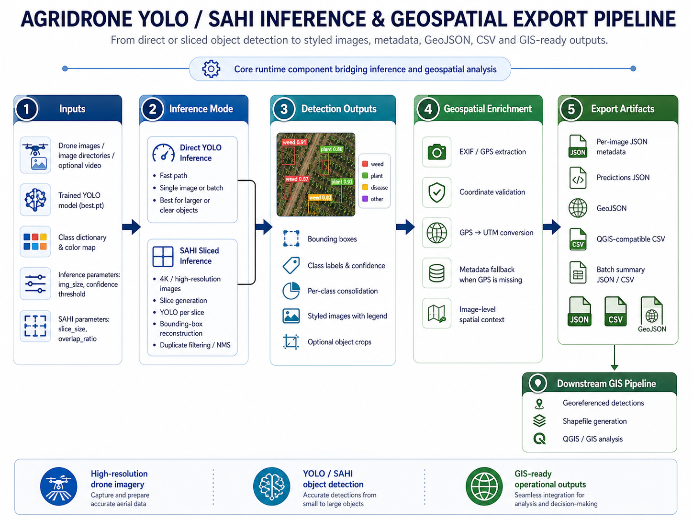

# Precision Agriculture Object Detection Pipeline


> **Production-oriented computer vision pipeline with integrated evaluation and research capabilities for object detection, geospatial processing, and COCO-based model evaluation on high-resolution agricultural drone imagery.**


### Core Runtime Stack

| Area | Technologies |
|---|---|
| **Programming Language** |  |
| **Object Detection** |  |
| **Sliced Inference** |  |
| **Deep Learning Runtime** |  |
| **Augmentation / Training Variability** | Albumentations, Ultralytics augmentation parameters |
| **Distributed Training Runtime** | PyTorch DataParallel, DistributedDataParallel, `torch.distributed.run` |
| **Image Processing** |   |
| **Video Tracking** | OpenCV VideoCapture/VideoWriter, Ultralytics `model.track()`, tracking IDs, optional SRT outputs |
| **Evaluation** |  |
| **Numerical Processing** |  |
| **Visualization** |  |
| **Runtime Acceleration** | , cuDNN, NVIDIA GPU driver stack |
| **Benchmarking Support** | PyYAML, Ultralytics `model.val()`, CUDA warm-up, ClearML logging |

### Geospatial Processing & GIS Outputs

| Area | Technologies / Formats |
|---|---|
| **Metadata Handling** | EXIF / GPS metadata extraction |
| **Coordinate Transformation** |  |
| **Geospatial Data Processing** |  |
| **Spatial Output Formats** |   |
| **GIS Compatibility** | QGIS-compatible CSV / GeoJSON / Shapefile outputs |
| **Raster Georeferencing** | JPEG + JGW world files, optional GeoTIFF, GDAL/OGR, PyQGIS, ExifTool |

---

## 🌟 Overview

**AgriDrone Vision Evaluation Pipeline** is a computer vision and machine learning evaluation system designed to process high-resolution drone imagery in agricultural environments. The project integrates YOLO-based object detection, SAHI slicing inference, geospatial metadata extraction, standardized COCO evaluation metrics, and automated reporting.

The pipeline was designed to support reproducible experimentation with object detection models applied to aerial agricultural imagery, where objects of interest may be small, partially occluded, visually ambiguous, or distributed across large 4K images.

The system enables direct comparison between standard YOLO inference and SAHI-based sliced inference, helping evaluate how different inference strategies affect detection quality, recall, precision, and model robustness in real-world drone image conditions.


---
> **Note:** While the system is designed with production-oriented architecture principles, its current implementation corresponds to an advanced research-grade pipeline rather than a fully productionized system. The evaluation setup also includes high-resolution (4K) imagery to expose performance differences that may not appear under standard validation conditions, particularly due to resolution scaling effects and shifts in object size distribution.


---

## 🖼️ Visual Overview

### Featured Poster: Pipeline Overview


> **Visual scope note:** The README should prioritize a small set of complementary diagrams: executive overview, system architecture, experiment orchestration, evaluation lifecycle, and GIS/shapefile generation. More detailed operational diagrams, such as the YOLO/SAHI inference-export flow, are referenced from their module-specific documents to avoid repeating the same `drone image → YOLO/SAHI → metadata → GIS` story at the same level.

### Additional Posters
<div align="center">

**📺 Project Posters Carousel**

Explore more posters:

[**Poster 2: System Architecture**](assets/images/agridrone-vision-evaluation-pipeline2.png) • [**Poster 3: Evaluation Pipeline**](assets/images/agridrone-vision-evaluation-pipeline-3-evaluation.png) • [**Poster 4: Shapefile Generation**](assets/images/agridrone-vision-evaluation-pipeline-4-shapefile-generation.png)

</div>

---


## 🛠️ Technology Stack

The stack is intentionally separated by role. The **core runtime pipeline** focuses on YOLO/SAHI inference, COCO evaluation, geospatial metadata processing, and GIS-ready artifact generation. Other tools are documented as supporting, auxiliary, or external workflow tools rather than core system dependencies.

### Supporting Reporting & Data Artifacts

These tools support tabular summaries, reports, and generated artifacts. They are not the central ML runtime.

| Area | Technologies / Formats |
|---|---|
| **Tabular Reporting** | Pandas, CSV |
| **Structured Artifacts** | JSON |
| **Documentation Source** | Markdown |
| **Metric Visualizations** | PNG plots, curve images, confusion matrices |

### Auxiliary Dataset Diagnostics / Experiment Workflow

These tools are part of the broader experimentation and dataset improvement workflow. They should be understood as supporting tools, not required runtime components of the core inference pipeline.

| Area | Tools |
|---|---|
| **Dataset Diagnostics** | FiftyOne, embeddings analysis, UMAP, mistakenness / spurious detection review |
| **Annotation / Dataset Preparation** | CVAT, Roboflow |
| **Experiment Tracking / Review** | ClearML |
| **Dataset Organization** | Dataset-versioned experimentation workflow using structured releases and validation folders |

### Documentation Automation Support

These tools apply specifically to the validation-artifact reporting module. They should not be interpreted as core computer vision dependencies.

| Area | Tools |
|---|---|
| **Automation Scripts** | Bash |
| **Artifact Linking** | Linux filesystem, symbolic links |
| **PDF Rendering** | Pandoc, LaTeX / xelatex |
| **Environment Support** | Linux / Ubuntu, Docker for reproducible rendering environments |

> **Scope note:** Tools such as Pandoc, LaTeX, Bash, symbolic links, FiftyOne, ClearML, CVAT, and Roboflow are documented because they support experimentation, dataset diagnostics, or reporting workflows. The core technical system remains the YOLO/SAHI computer vision pipeline with COCO evaluation and geospatial artifact generation.

---

## 🚀 Problem Statement

Agricultural image analysis using drones introduces several technical challenges:

- **High-resolution images** are computationally expensive to process.
- **Small objects** are difficult to detect when images are resized before inference.
- **Object density, occlusion, lighting variation, and image noise** can degrade model performance.
- **Standard evaluation workflows** are often inconsistent or difficult to reproduce.
- **Geospatial context** is frequently separated from computer vision results.
- **Manual inspection** does not scale for large datasets.

This project addresses these challenges by building a reproducible evaluation pipeline that connects object detection, geospatial processing, structured outputs, and scientific metrics into a single workflow.

---

## 🎯 Main Objectives

> The system is designed as a production-oriented pipeline with integrated evaluation and experimental capabilities, enabling both operational deployment and controlled performance analysis.

### Core Pipeline Objectives

- Execute YOLO inference on high-resolution drone images.
- Support SAHI slicing inference for improved detection of small objects in 4K imagery.
- Export normalized YOLO predictions.
- Convert YOLO ground truth and predictions into COCO format.
- Evaluate model performance using `pycocotools`.
- Generate global and per-class metrics.
- Produce JSON, CSV, and visualization outputs for model evaluation.
- Extract GPS/EXIF metadata from drone images.
- Generate geospatial outputs such as GeoJSON, CSV, and shapefiles.
- Provide a reproducible workflow for object detection benchmarking and applied agricultural research.

### Supporting Experimentation and Reporting Objectives

- Organize experiments using dataset-versioned folders and structured validation outputs.
- Support best-model review using validation metrics such as mAP and F1 when available.
- Generate validation artifacts such as confusion matrices, metric curves, prediction examples, and JSON summaries.
- Link validation artifacts into Markdown documentation using symbolic links when documentation automation is required.
- Render Markdown documentation into PDF using Pandoc and LaTeX as an auxiliary reporting workflow.
- Support dataset curation and diagnostics using tools such as FiftyOne, embeddings analysis, mistakenness review, and spurious detection inspection when applicable.

> **Scope clarification:** Dataset versioning, Pandoc/LaTeX rendering, symbolic links, FiftyOne, ClearML, CVAT, and Roboflow are treated as supporting experimentation or documentation workflows. They are not presented as core runtime services of the inference/evaluation engine.

---

## 🧩 Specialized Technical Pipelines

The project includes specialized sub-pipelines. Some are part of the core runtime workflow, while others support experimentation, dataset diagnostics, or documentation automation.

| Pipeline | Purpose | Documentation |
|---|---|---|
| **YOLO Training, Validation and Inference Orchestrator** | Coordinates YOLOv8/YOLOv11 training, validation, best-model selection, inference, SAHI, ClearML tracking, and artifact persistence. | `docs/yolo-cli-training-validation-inference-pipeline.md` |
| **YOLO / SAHI Inference Pipeline** | Runs direct YOLO or SAHI sliced inference over images, directories, and video sources. | `docs/methodology.md` |
| **YOLO / SAHI Inference and Geospatial Export Pipeline** | Executes direct YOLO or SAHI inference on agricultural drone imagery, generates styled detections, extracts EXIF/GPS metadata, converts GPS to UTM when available, and exports JSON, CSV, GeoJSON, QGIS-ready summaries, and batch outputs. | `docs/yolo-sahi-inference-geospatial-export-pipeline.md` |
| **YOLO Video Inference & Object Tracking Processor** | Processes videos frame by frame with YOLO tracking, counts unique objects using tracking IDs, renders custom OpenCV overlays, and exports annotated video, JSON counts, and optional `.srt` frame summaries. | `docs/yolo-video-inference-object-tracking-processor.md` |
| **COCO Evaluation Pipeline** | Converts YOLO predictions and ground truth into COCO format and evaluates AP50, AP50:95, Precision, Recall, and F1. | `docs/evaluation.md` |
| **Georeferenced Detection & Shapefile Generation Pipeline** | Converts detections into GIS-ready GeoJSON, CSV, and shapefiles using GPS/EXIF metadata. | `docs/georeferenced-detection-shapefile-pipeline.md` |
| **Raster Georeferencing & QGIS Automation Pipeline** | Preserves EXIF/XMP metadata, generates `.jgw` world files for styled JPEGs, supports optional GeoTIFF fallback, and automates QGIS raster loading with PyQGIS. | `docs/raster-georeferencing-qgis-automation-pipeline.md` |
| **Validation Artifact Reporting Pipeline** | Links YOLO validation artifacts into Markdown reports and renders reproducible PDFs with Pandoc and LaTeX. | `docs/validation-artifact-reporting-pipeline.md` |
| **Dataset Curation & Diagnostics Workflow** | Auxiliary workflow for dataset quality review using validation analysis, embeddings, FiftyOne, and error inspection when applicable. | `docs/methodology.md` |

---

## 🔍 YOLO / SAHI Inference and Geospatial Export

The project includes a core inference and geospatial export pipeline that operationalizes model predictions over agricultural drone imagery.

This module connects direct YOLO inference, SAHI sliced inference, visual output generation, EXIF/GPS metadata extraction, UTM conversion, and GIS-compatible exports.

It focuses on:

- selecting the trained `best.pt` checkpoint according to the active configuration
- processing single images, directories, or video sources
- running direct YOLO inference or SAHI sliced inference
- reconstructing SAHI detections into full-image coordinates
- consolidating detections by class
- generating styled images with bounding boxes and legends
- extracting EXIF/GPS metadata from drone images
- converting GPS coordinates to UTM when available
- exporting per-image JSON metadata and predictions
- generating GeoJSON outputs
- producing QGIS-compatible CSV summaries
- generating batch-level JSON and CSV summaries
- optionally exporting object crops when enabled

This service is part of the core runtime workflow because it transforms images into operational detection artifacts and geospatial outputs that can later feed evaluation, GIS analysis, shapefile generation, and technical reporting.

See: `docs/yolo-sahi-inference-geospatial-export-pipeline.md`

---

## 🎥 YOLO Video Inference & Object Tracking

The project also includes a dedicated video inference path for temporal object detection and tracking.

Unlike static image inference, video processing introduces state across frames. The processor can:

- open videos with OpenCV
- run Ultralytics `model.track()` frame by frame
- extract bounding boxes, confidence values, class IDs, and tracking IDs
- count unique objects by class using persistent `box.id` values
- render custom OpenCV overlays with configured class colors
- preserve original video colors by controlling RGB/BGR conversion
- write annotated video outputs
- export final JSON count summaries
- optionally generate `.srt` frame-level detection summaries

Important limitation:

```text
Unique object counts are only as reliable as tracker ID stability.
```

### Video Processor Implementation Contracts

The video processor includes lower-level implementation contracts that are important for correctness:

- `safe_extract_bbox_info_video` defensively handles `xyxy` / `xywh` differences in Ultralytics box objects.
- `labels_dict` and color maps should normalize JSON string keys into integer class IDs.
- the renderer dynamically scales font size and bounding-box thickness based on video resolution.
- fallback colors and fonts prevent rendering failures in incomplete configurations or minimal environments.
- JSON outputs should convert NumPy, tensor, set, and path values into JSON-safe Python types.
- OpenCV `VideoCapture` and `VideoWriter` resources must be released explicitly to avoid corrupted video artifacts.
- long videos should avoid excessive per-frame debug logging because logging can become a performance bottleneck.
- the selected `best.pt` for video inference should persist model-selection lineage from `get_best_model`.

These details are documented in:

```text
docs/yolo-video-inference-object-tracking-processor.md
```

Recommended detailed document:

```text
docs/yolo-video-inference-object-tracking-processor.md
```

---

## 🗺️ Raster Georeferencing & QGIS Automation

The project also includes a raster-oriented post-processing workflow for styled detection images.

This workflow addresses a practical GIS interoperability issue:

```text
EXIF GPS metadata copied into a JPEG is not sufficient for QGIS raster placement.
```

To make styled YOLO/SAHI output images load as georeferenced rasters, the pipeline can:

- copy full EXIF/XMP metadata from the original image into the styled JPEG using ExifTool
- generate a `.jgw` world file containing the six affine transform parameters
- use altitude/FOV-derived scale or fallback spatial assumptions when needed
- optionally use `GPSImgDirection` for rotation
- preserve CRS assumptions in sidecar metadata
- convert styled images to GeoTIFF with GDAL when JPEG + JGW is insufficient
- batch-load `.jpg` rasters into QGIS with PyQGIS while letting QGIS apply `.jgw` files implicitly

Recommended detailed document:

```text
docs/raster-georeferencing-qgis-automation-pipeline.md
```

---

## 🧪 YOLO Dataset Validation & Benchmarking

The project includes a dedicated validation and benchmarking service for reproducible YOLO model evaluation over agricultural datasets.

This component is invoked through the CLI orchestration layer and focuses on:

- resolving trained `best.pt` checkpoints
- reading training metadata such as `args.yaml`
- generating temporary validation YAML files for target splits
- executing GPU warm-up before benchmarking
- clearing CUDA cache between runs
- running Ultralytics `model.val()`
- extracting global and per-class metrics
- computing average time per image and run-to-run variability
- logging metrics and artifacts to ClearML when enabled
- persisting structured JSON summaries per validation run

See: `docs/yolo-dataset-validation-benchmarking-service.md`

---

## 📄 Reproducible Validation Reporting

This is an auxiliary documentation automation workflow that links YOLO validation artifacts—such as confusion matrices, precision-recall curves, F1 curves, prediction examples, and JSON metric summaries—into Markdown-based technical reports.

Instead of duplicating experimental outputs, the workflow uses symbolic links to preserve a single source of truth across dataset versions and validation runs. Markdown documentation can then be rendered into publication-ready PDF reports using Pandoc and LaTeX.

This support module can be used for:

- dataset-versioned validation reports
- symbolic linking of validation artifacts
- Markdown documentation enrichment
- PDF rendering through Pandoc and LaTeX
- reproducible experiment documentation
- artifact traceability without file duplication

See: `docs/validation-artifact-reporting-pipeline.md`

---

## 🧠 Implementation-Level Engineering Notes

The project includes several implementation details that are important for correctly interpreting the system beyond the conceptual pipeline description.

### Training and Multi-GPU Execution

The training workflow may run under single-GPU execution, PyTorch DataParallel, or Distributed Data Parallel depending on the environment and selected configuration. Multi-GPU execution affects checkpoint paths, metric availability, CUDA memory pressure, and post-training validation behavior.

### Metric Recovery After Training

In some multi-GPU or Ultralytics execution paths, `model.train()` may not return complete metric objects. When that happens, the pipeline should recover metrics by validating the generated `best.pt` checkpoint after training and persisting those recovered metrics with the run metadata.

### Checkpoint Lineage

For multi-run experiments, the selected `best.pt` must be tied to the correct run, configuration, image size, seed, and `results.csv`. Validating a stale or incorrect checkpoint would invalidate model comparison results.

### Reproducibility Metadata

Each run should persist a resolved `run_id`, seed, model path, dataset YAML, image size, batch size, inference mode, `max_det`, SAHI parameters, and output paths. Dynamic timestamps are useful for folder organization, but a stable run identifier is required for reliable experiment traceability.

### Local-First Tracking Policy

ClearML is treated as an external tracking sink. Local JSON/CSV summaries and filesystem artifacts should remain authoritative so that validation, inference, and reporting can complete even if remote tracking fails.

### Additional Runtime and Experiment-Control Notes

The implementation contains several engineering controls that are important for interpreting experiment results:

- The first training run may be treated as a reproducible baseline with augmentations disabled, while later runs can enable dynamic augmentation policies.
- Augmentation behavior should be recorded explicitly because Ultralytics internal defaults may not always match a high-level `augment=False` assumption.
- Multi-GPU execution can use single GPU, DataParallel, or DDP. DDP starts subprocesses through PyTorch distributed execution, but this does not mean the overall system is a persistent asynchronous job platform.
- Large configurations such as YOLOv11 / YOLO11x with 2048px imagery can require CUDA memory-stabilization practices such as cache cleanup, garbage collection, or PyTorch allocator configuration.
- Video inference may generate processed videos and `.srt` subtitle outputs when frame-level detection summaries are enabled.
- Project names and dataset names should be sanitized before being used as filesystem paths.


---
## 🏗️ System Architecture

### Diagram 1: High-Level Architecture


### Diagram 2: Detailed Architecture


---
## 📈 System Flow

### Step 1: Execution Trigger

The user runs the main script and selects the desired workflow, such as inference, evaluation, or comparative analysis.

### Step 2: Data Loading

The system loads:

- Drone images
- YOLO model weights
- Ground truth annotations
- Class dictionary
- Inference parameters
- Input and output directories

### Step 3: Inference

The system executes one of two inference strategies:

1. Direct YOLO inference
2. SAHI sliced inference

For SAHI inference, image slices are processed independently and then reconstructed into full-image coordinates.

### Step 3B: Inference and Geospatial Export

When the selected workflow is inference, the system executes the dedicated YOLO / SAHI inference and geospatial export pipeline.

This stage may generate:

- styled images with bounding boxes
- per-image JSON prediction metadata
- EXIF/GPS metadata records
- UTM coordinates when GPS metadata is available
- GeoJSON outputs
- QGIS-compatible CSV summaries
- batch-level JSON and CSV summaries

This operational inference pipeline is documented in `docs/yolo-sahi-inference-geospatial-export-pipeline.md`.

### Step 4: Prediction Export

Detections are normalized and exported as YOLO-format `.txt` files.

### Step 5: Geospatial Metadata Extraction

The system extracts GPS and EXIF metadata from drone images, converts coordinates, and generates geospatial output files.

### Poster 5: YOLO / SAHI Inference and Geospatial Export


### Step 6: COCO Conversion

Ground truth annotations and model predictions are converted into COCO JSON format.

### Step 7: Evaluation

The system evaluates predictions using COCO metrics with `pycocotools`.

### Step 8: Reporting

The system generates JSON reports, CSV files, and plots for global and per-class model performance.

### Step 9: Validation Artifact Linking and Documentation Rendering

When report generation is required, the auxiliary reporting automation module links validation artifacts such as confusion matrices, metric curves, prediction examples, and JSON summaries into Markdown documentation using symbolic links.

The enriched Markdown documentation can then be rendered into PDF using Pandoc and LaTeX. This is a reporting/documentation layer, not a core inference dependency.

### Step 10: Final Outputs

The final result is a reproducible evaluation package containing predictions, geospatial files, COCO artifacts, metrics, and visual reports. When the auxiliary reporting workflow is used, Markdown and PDF documentation can also be generated.

---

## 📘 Documentation Map

Detailed documentation is organized under `docs/`:

```text
docs/
├── architecture.md
├── methodology.md
├── evaluation.md
├── geospatial-processing.md
├── georeferenced-detection-shapefile-pipeline.md
├── raster-georeferencing-qgis-automation-pipeline.md
├── yolo-cli-training-validation-inference-pipeline.md
├── yolo-dataset-validation-benchmarking-service.md
├── yolo-sahi-inference-geospatial-export-pipeline.md
├── validation-artifact-reporting-pipeline.md
└── limitations.md
```

Recommended reading order:

1. `architecture.md`
2. `yolo-cli-training-validation-inference-pipeline.md`
3. `yolo-dataset-validation-benchmarking-service.md`
4. `yolo-sahi-inference-geospatial-export-pipeline.md`
5. `methodology.md`
6. `evaluation.md`
7. `geospatial-processing.md`
8. `georeferenced-detection-shapefile-pipeline.md`
9. `raster-georeferencing-qgis-automation-pipeline.md`
10. `validation-artifact-reporting-pipeline.md`
11. `limitations.md`

---

## 📚 Privacy & Confidentiality Notice

This repository is intended to document the architecture, methodology, and technical approach of a computer vision system for agricultural drone imagery.

It does not include:

- Confidential client data
- Proprietary datasets
- Private business information
- Production credentials
- Internal endpoints
- Sensitive geospatial locations
- Private model weights, unless explicitly authorized

Any sample images, annotations, or outputs included in this repository should be anonymized, synthetic, or publicly shareable.
