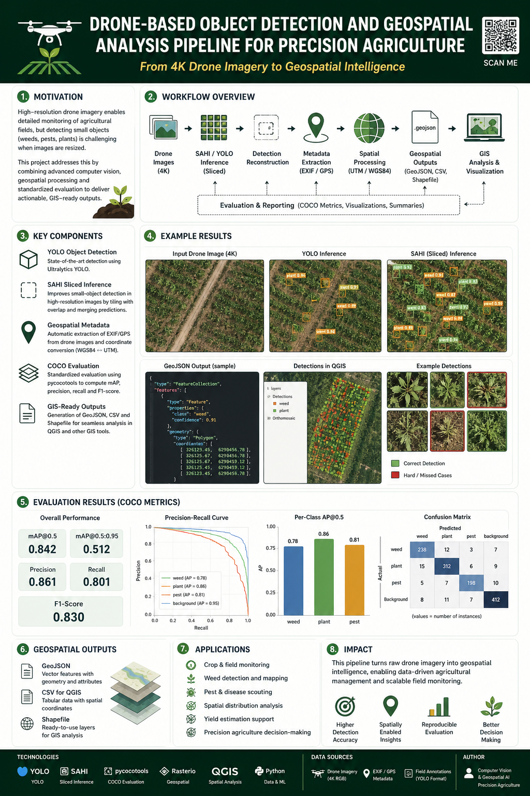
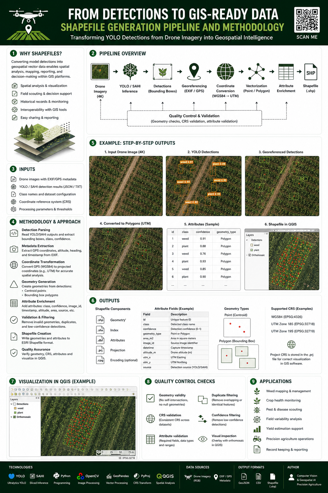
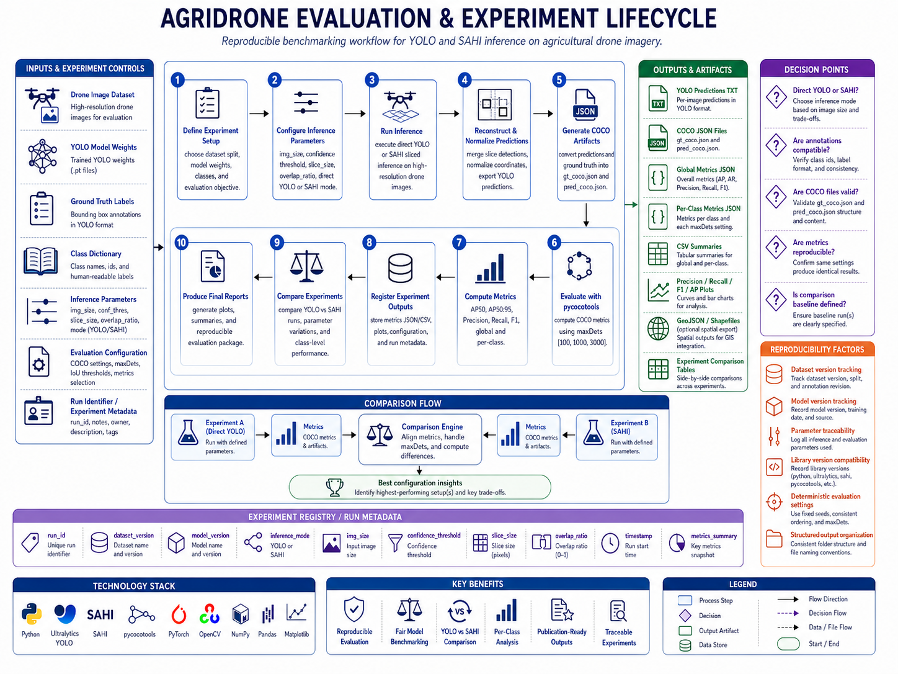
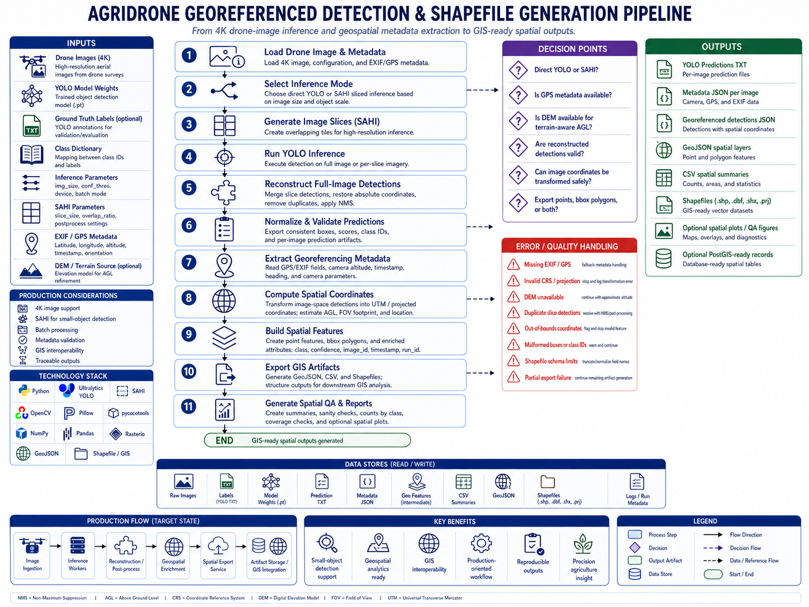
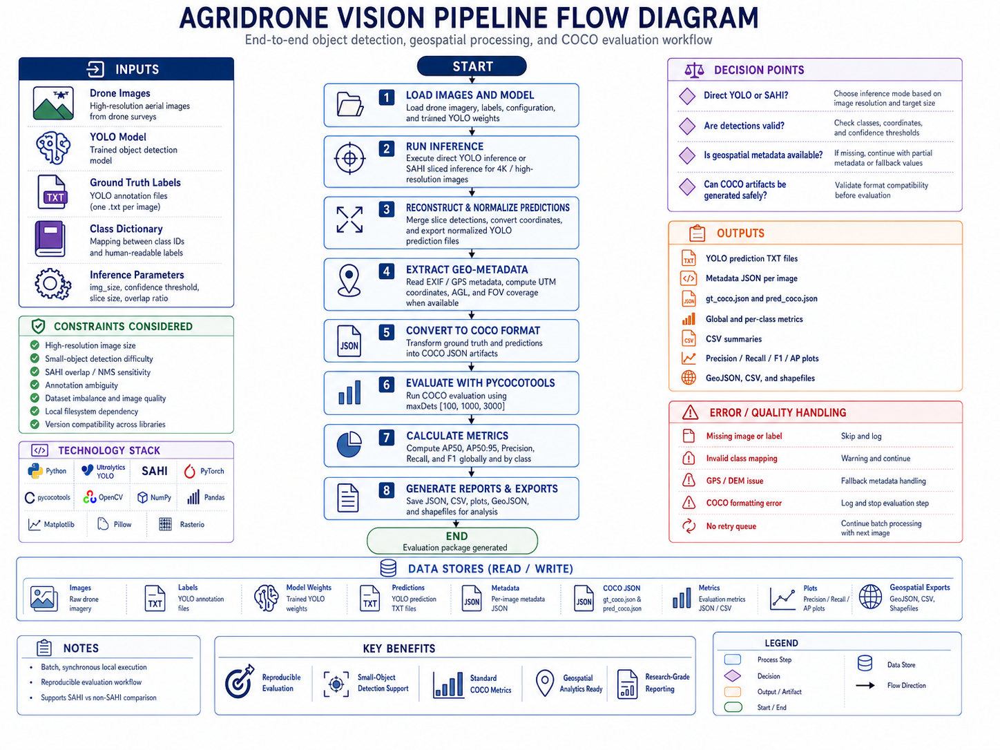

# Precision Agriculture Object Detection Pipeline

> **Research-grade computer vision pipeline for object detection, geospatial processing, and COCO-based model evaluation on high-resolution agricultural drone imagery.**

---

### Core Runtime Stack

| Area | Technologies |
|---|---|
| **Programming Language** |  |
| **Object Detection** |  |
| **Sliced Inference** |  |
| **Deep Learning Runtime** |  |
| **Image Processing** |   |
| **Evaluation** |  |
| **Numerical Processing** |  |
| **Visualization** |  |
| **Runtime Acceleration** |  |
| **Benchmarking Support** | PyYAML, Ultralytics `model.val()`, CUDA warm-up, ClearML logging |

### Geospatial Processing & GIS Outputs

| Area | Technologies / Formats |
|---|---|
| **Metadata Handling** | EXIF / GPS metadata extraction |
| **Coordinate Transformation** |  |
| **Geospatial Data Processing** |  |
| **Spatial Output Formats** |   |
| **GIS Compatibility** | QGIS-compatible CSV / GeoJSON / Shapefile outputs |

---

## 🌟 Overview

**AgriDrone Vision Evaluation Pipeline** is a computer vision and machine learning evaluation system designed to process high-resolution drone imagery in agricultural environments. The project integrates YOLO-based object detection, SAHI slicing inference, geospatial metadata extraction, standardized COCO evaluation metrics, and automated reporting.

The pipeline was designed to support reproducible experimentation with object detection models applied to aerial agricultural imagery, where objects of interest may be small, partially occluded, visually ambiguous, or distributed across large 4K images.

The system enables direct comparison between standard YOLO inference and SAHI-based sliced inference, helping evaluate how different inference strategies affect detection quality, recall, precision, and model robustness in real-world drone image conditions.

---

## 🖼️ Visual Overview

### Poster 1: Pipeline Overview

### Poster 2: System Architecture

### Poster 3: Evaluation Pipeline

### Poster 4: Shapefile Generation

---

## 🛠️ Technology Stack

The stack is intentionally separated by role. The **core runtime pipeline** focuses on YOLO/SAHI inference, COCO evaluation, geospatial metadata processing, and GIS-ready artifact generation. Other tools are documented as supporting, auxiliary, or external workflow tools rather than core system dependencies.

### Supporting Reporting & Data Artifacts

These tools support tabular summaries, reports, and generated artifacts. They are not the central ML runtime.

| Area | Technologies / Formats |
|---|---|
| **Tabular Reporting** | Pandas, CSV |
| **Structured Artifacts** | JSON |
| **Documentation Source** | Markdown |
| **Metric Visualizations** | PNG plots, curve images, confusion matrices |

### Auxiliary Dataset Diagnostics / Experiment Workflow

These tools are part of the broader experimentation and dataset improvement workflow. They should be understood as supporting tools, not required runtime components of the core inference pipeline.

| Area | Tools |
|---|---|
| **Dataset Diagnostics** | FiftyOne, embeddings analysis, UMAP, mistakenness / spurious detection review |
| **Annotation / Dataset Preparation** | CVAT, Roboflow |
| **Experiment Tracking / Review** | ClearML |
| **Dataset Organization** | Dataset-versioned experimentation workflow using structured releases and validation folders |

### Documentation Automation Support

These tools apply specifically to the validation-artifact reporting module. They should not be interpreted as core computer vision dependencies.

| Area | Tools |
|---|---|
| **Automation Scripts** | Bash |
| **Artifact Linking** | Linux filesystem, symbolic links |
| **PDF Rendering** | Pandoc, LaTeX / xelatex |
| **Environment Support** | Linux / Ubuntu, Docker for reproducible rendering environments |

> **Scope note:** Tools such as Pandoc, LaTeX, Bash, symbolic links, FiftyOne, ClearML, CVAT, and Roboflow are documented because they support experimentation, dataset diagnostics, or reporting workflows. The core technical system remains the YOLO/SAHI computer vision pipeline with COCO evaluation and geospatial artifact generation.

---

## 🚀 Problem Statement

Agricultural image analysis using drones introduces several technical challenges:

- **High-resolution images** are computationally expensive to process.
- **Small objects** are difficult to detect when images are resized before inference.
- **Object density, occlusion, lighting variation, and image noise** can degrade model performance.
- **Standard evaluation workflows** are often inconsistent or difficult to reproduce.
- **Geospatial context** is frequently separated from computer vision results.
- **Manual inspection** does not scale for large datasets.

This project addresses these challenges by building a reproducible evaluation pipeline that connects object detection, geospatial processing, structured outputs, and scientific metrics into a single workflow.

---

## 🎯 Main Objectives

### Core Pipeline Objectives

- Execute YOLO inference on high-resolution drone images.
- Support SAHI slicing inference for improved detection of small objects in 4K imagery.
- Export normalized YOLO predictions.
- Convert YOLO ground truth and predictions into COCO format.
- Evaluate model performance using `pycocotools`.
- Generate global and per-class metrics.
- Produce JSON, CSV, and visualization outputs for model evaluation.
- Extract GPS/EXIF metadata from drone images.
- Generate geospatial outputs such as GeoJSON, CSV, and shapefiles.
- Provide a reproducible workflow for object detection benchmarking and applied agricultural research.

### Supporting Experimentation and Reporting Objectives

- Organize experiments using dataset-versioned folders and structured validation outputs.
- Support best-model review using validation metrics such as mAP and F1 when available.
- Generate validation artifacts such as confusion matrices, metric curves, prediction examples, and JSON summaries.
- Link validation artifacts into Markdown documentation using symbolic links when documentation automation is required.
- Render Markdown documentation into PDF using Pandoc and LaTeX as an auxiliary reporting workflow.
- Support dataset curation and diagnostics using tools such as FiftyOne, embeddings analysis, mistakenness review, and spurious detection inspection when applicable.

> **Scope clarification:** Dataset versioning, Pandoc/LaTeX rendering, symbolic links, FiftyOne, ClearML, CVAT, and Roboflow are treated as supporting experimentation or documentation workflows. They are not presented as core runtime services of the inference/evaluation engine.

---

## 🧩 Specialized Technical Pipelines

The project includes specialized sub-pipelines. Some are part of the core runtime workflow, while others support experimentation, dataset diagnostics, or documentation automation.

| Pipeline | Purpose | Documentation |
|---|---|---|
| **YOLO / SAHI Inference Pipeline** | Runs direct YOLO or SAHI sliced inference over images, directories, and video sources. | `docs/methodology.md` |
| **COCO Evaluation Pipeline** | Converts YOLO predictions and ground truth into COCO format and evaluates AP50, AP50:95, Precision, Recall, and F1. | `docs/evaluation.md` |
| **Georeferenced Detection & Shapefile Generation Pipeline** | Converts detections into GIS-ready GeoJSON, CSV, and shapefiles using GPS/EXIF metadata. | `docs/georeferenced-detection-shapefile-pipeline.md` |
| **Validation Artifact Reporting Pipeline** | Links YOLO validation artifacts into Markdown reports and renders reproducible PDFs with Pandoc and LaTeX. | `docs/validation-artifact-reporting-pipeline.md` |
| **Dataset Curation & Diagnostics Workflow** | Auxiliary workflow for dataset quality review using validation analysis, embeddings, FiftyOne, and error inspection when applicable. | `docs/methodology.md` |

---

## 🧪 YOLO Dataset Validation & Benchmarking

The project includes a dedicated validation and benchmarking service for reproducible YOLO model evaluation over agricultural datasets.

This component is invoked through the CLI orchestration layer and focuses on:

- resolving trained `best.pt` checkpoints
- reading training metadata such as `args.yaml`
- generating temporary validation YAML files for target splits
- executing GPU warm-up before benchmarking
- clearing CUDA cache between runs
- running Ultralytics `model.val()`
- extracting global and per-class metrics
- computing average time per image and run-to-run variability
- logging metrics and artifacts to ClearML when enabled
- persisting structured JSON summaries per validation run

See: `docs/yolo-dataset-validation-benchmarking-service.md`

---

## 📄 Reproducible Validation Reporting

This is an auxiliary documentation automation workflow that links YOLO validation artifacts—such as confusion matrices, precision-recall curves, F1 curves, prediction examples, and JSON metric summaries—into Markdown-based technical reports.

Instead of duplicating experimental outputs, the workflow uses symbolic links to preserve a single source of truth across dataset versions and validation runs. Markdown documentation can then be rendered into publication-ready PDF reports using Pandoc and LaTeX.

This support module can be used for:

- dataset-versioned validation reports
- symbolic linking of validation artifacts
- Markdown documentation enrichment
- PDF rendering through Pandoc and LaTeX
- reproducible experiment documentation
- artifact traceability without file duplication

See: `docs/validation-artifact-reporting-pipeline.md`

---

## 🏗️ System Architecture

### Diagram 1: High-Level Architecture

### Diagram 2: Detailed Architecture

---
## 📈 System Flow

### Step 1: Execution Trigger

The user runs the main script and selects the desired workflow, such as inference, evaluation, or comparative analysis.

### Step 2: Data Loading

The system loads:

- Drone images
- YOLO model weights
- Ground truth annotations
- Class dictionary
- Inference parameters
- Input and output directories

### Step 3: Inference

The system executes one of two inference strategies:

1. Direct YOLO inference
2. SAHI sliced inference

For SAHI inference, image slices are processed independently and then reconstructed into full-image coordinates.

### Step 4: Prediction Export

Detections are normalized and exported as YOLO-format `.txt` files.

### Step 5: Geospatial Metadata Extraction

The system extracts GPS and EXIF metadata from drone images, converts coordinates, and generates geospatial output files.

### Step 6: COCO Conversion

Ground truth annotations and model predictions are converted into COCO JSON format.

### Step 7: Evaluation

The system evaluates predictions using COCO metrics with `pycocotools`.

### Step 8: Reporting

The system generates JSON reports, CSV files, and plots for global and per-class model performance.

### Step 9: Validation Artifact Linking and Documentation Rendering

When report generation is required, the auxiliary reporting automation module links validation artifacts such as confusion matrices, metric curves, prediction examples, and JSON summaries into Markdown documentation using symbolic links.

The enriched Markdown documentation can then be rendered into PDF using Pandoc and LaTeX. This is a reporting/documentation layer, not a core inference dependency.

### Step 10: Final Outputs

The final result is a reproducible evaluation package containing predictions, geospatial files, COCO artifacts, metrics, and visual reports. When the auxiliary reporting workflow is used, Markdown and PDF documentation can also be generated.

---

## 📚 Privacy & Confidentiality Notice

This repository is intended to document the architecture, methodology, and technical approach of a computer vision system for agricultural drone imagery.

It does not include:

- Confidential client data
- Proprietary datasets
- Private business information
- Production credentials
- Internal endpoints
- Sensitive geospatial locations
- Private model weights, unless explicitly authorized

Any sample images, annotations, or outputs included in this repository should be anonymized, synthetic, or publicly shareable.
