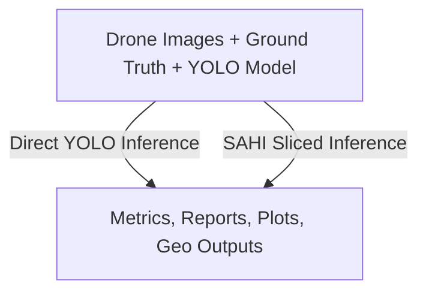

# Precision Agriculture Object Detection Pipeline

> **Research-grade computer vision pipeline for object detection, geospatial processing, and COCO-based model evaluation on high-resolution agricultural drone imagery.**

---

## Project Overview

**AgriDrone Vision Evaluation Pipeline** is a computer vision and machine learning evaluation system designed to process high-resolution drone imagery in agricultural environments. The project integrates YOLO-based object detection, SAHI slicing inference, geospatial metadata extraction, standardized COCO evaluation metrics, and automated reporting.

The pipeline was designed to support reproducible experimentation with object detection models applied to aerial agricultural imagery, where objects of interest may be small, partially occluded, visually ambiguous, or distributed across large 4K images.

The system enables direct comparison between standard YOLO inference and SAHI-based sliced inference, helping evaluate how different inference strategies affect detection quality, recall, precision, and model robustness in real-world drone image conditions.

---

## Problem Statement

Agricultural image analysis using drones introduces several technical challenges:

- **High-resolution images** are computationally expensive to process.
- **Small objects** are difficult to detect when images are resized before inference.
- **Object density, occlusion, lighting variation, and image noise** can degrade model performance.
- **Standard evaluation workflows** are often inconsistent or difficult to reproduce.
- **Geospatial context** is frequently separated from computer vision results.
- **Manual inspection** does not scale for large datasets.

This project addresses these challenges by building a reproducible evaluation pipeline that connects object detection, geospatial processing, structured outputs, and scientific metrics into a single workflow.

---

## Main Objectives

- Execute YOLO inference on high-resolution drone images.
- Support SAHI slicing inference for improved detection of small objects.
- Export normalized YOLO predictions.
- Convert YOLO ground truth and predictions into COCO format.
- Evaluate model performance using `pycocotools`.
- Generate global and per-class metrics.
- Produce CSV, JSON, and visualization outputs for reporting.
- Extract GPS/EXIF metadata from drone images.
- Generate geospatial outputs such as GeoJSON, CSV, and shapefiles.
- Provide a reproducible workflow for model benchmarking and applied research.

---

## System Architecture



---

## Main Components

### 1. Main Orchestrator

**Responsibilities:**

- Load configuration parameters.
- Select inference mode.
- Coordinate input and output directories.
- Trigger inference and evaluation processes.
- Manage batch execution over multiple images.

---

### 2. YOLO Inference Service

**Responsibilities:**

- Load trained YOLO weights.
- Process drone images.
- Generate object detections.
- Export bounding boxes, classes, and confidence scores.
- Save predictions in normalized YOLO format.

**Typical outputs:**

```text
<class_id> <x_center> <y_center> <width> <height> <confidence>
```

---

### 3. SAHI Inference Service

**Responsibilities:**

- Split high-resolution images into slices.
- Run YOLO inference on each slice.
- Reconstruct detections in full-image coordinates.
- Handle overlapping detections.
- Improve detection of small objects.

**Key parameters:**

```text
slice_size
overlap_ratio
confidence_threshold
img_size
```

---

### 4. Prediction Normalization Module

**Responsibilities:**

- Convert absolute bounding boxes to YOLO-normalized coordinates.
- Validate class IDs against the class dictionary.
- Ensure compatibility between predictions, image dimensions, and evaluation modules.
- Persist `.txt` prediction files.

---

### 5. Geospatial Processing Service

**Responsibilities:**

- Read GPS metadata from EXIF fields.
- Convert geographic coordinates into UTM coordinates.
- Calculate altitude-related metadata such as AGL when available.
- Estimate field-of-view coverage.
- Generate geospatial exports for GIS analysis.

**Outputs:**

- GeoJSON
- CSV
- Shapefiles
- Metadata JSON per image

---

### 6. COCO Conversion Module

**Responsibilities:**

- Convert ground truth labels to COCO format.
- Convert prediction files to COCO detection format.
- Preserve image IDs, category IDs, bounding boxes, and confidence scores.
- Validate JSON structure for compatibility with `pycocotools`.

**Generated files:**

```text
gt_coco.json
pred_coco.json
```

---

### 7. COCO Evaluation Service

**Responsibilities:**

- Load COCO ground truth and prediction files.
- Run object detection evaluation.
- Configure `maxDets` values for high-density drone imagery.
- Calculate global metrics.
- Calculate per-class metrics.

**Configured `maxDets`:**

```text
[100, 1000, 3000]
```

**Main metrics:**

- AP50
- AP50:95
- Precision
- Recall
- F1-score
- Per-class AP
- Per-class recall

---

### 8. Reporting and Visualization Module

**Responsibilities:**

- Save global metrics as JSON.
- Save per-class metrics as JSON.
- Export tabular metrics to CSV.
- Generate plots for Precision, Recall, F1, AP50, and AP50:95.
- Support comparative evaluation between direct YOLO inference and SAHI inference.

**Outputs:**

```text
eval_metrics_coco.json
global_metrics.json
per_class_metrics.json
metrics.csv
precision_plot.png
recall_plot.png
f1_plot.png
ap50_plot.png
ap5095_plot.png
```

---

## System Flow

### Step 1: Execution Trigger

The user runs the main script and selects the desired workflow, such as inference, evaluation, or comparative analysis.

### Step 2: Data Loading

The system loads:

- Drone images
- YOLO model weights
- Ground truth annotations
- Class dictionary
- Inference parameters
- Input and output directories

### Step 3: Inference

The system executes one of two inference strategies:

1. Direct YOLO inference
2. SAHI sliced inference

For SAHI inference, image slices are processed independently and then reconstructed into full-image coordinates.

### Step 4: Prediction Export

Detections are normalized and exported as YOLO-format `.txt` files.

### Step 5: Geospatial Metadata Extraction

The system extracts GPS and EXIF metadata from drone images, converts coordinates, and generates geospatial output files.

### Step 6: COCO Conversion

Ground truth annotations and model predictions are converted into COCO JSON format.

### Step 7: Evaluation

The system evaluates predictions using COCO metrics with `pycocotools`.

### Step 8: Reporting

The system generates JSON reports, CSV files, and plots for global and per-class model performance.

### Step 9: Final Outputs

The final result is a reproducible evaluation package containing predictions, geospatial files, COCO artifacts, metrics, and visual reports.

---

## Tech Stack

### Programming Language

- Python

### Machine Learning and Computer Vision

- Ultralytics YOLO
- SAHI
- PyTorch
- OpenCV
- Pillow

### Evaluation

- pycocotools

### Data Processing

- NumPy
- Pandas
- JSON
- CSV

### Visualization

- Matplotlib

### Geospatial Processing

- Rasterio
- EXIF/GPS metadata handling
- UTM coordinate conversion
- GeoJSON
- Shapefile export

### Infrastructure and Runtime

- Filesystem-based batch processing
- GPU acceleration with CUDA, when available
- Local batch execution

---

## Input Data

The pipeline expects:

```text
images/
  image_001.jpg
  image_002.jpg
  ...

labels/
  image_001.txt
  image_002.txt
  ...

models/
  trained_model.pt

config/
  classes.json or labels dictionary
```

Each YOLO ground truth file should follow the normalized YOLO format:

```text
<class_id> <x_center> <y_center> <width> <height>
```

---

## Output Artifacts

The system can generate:

```text
outputs/
  predictions/
    *.txt

  metadata/
    *.json

  coco/
    gt_coco.json
    pred_coco.json

  metrics/
    eval_metrics_coco.json
    global_metrics.json
    per_class_metrics.json
    metrics.csv

  plots/
    precision.png
    recall.png
    f1_score.png
    ap50.png
    ap5095.png

  geospatial/
    detections.geojson
    detections.csv
    detections.shp

  visualizations/
    annotated_images/
```

---

## Example Repository Structure

```text
agridrone-vision-evaluation-pipeline/
│
├── README.md
├── requirements.txt
├── config/
│   ├── config.example.yaml
│   └── classes.example.json
│
├── src/
│   ├── main.py
│   ├── inference/
│   │   ├── predict_yolo.py
│   │   └── predict_sahi.py
│   │
│   ├── evaluation/
│   │   ├── evaluation_metrics.py
│   │   ├── yolo_to_coco.py
│   │   └── coco_evaluator.py
│   │
│   ├── geospatial/
│   │   ├── exif_reader.py
│   │   ├── coordinate_transform.py
│   │   └── spatial_export.py
│   │
│   ├── reporting/
│   │   ├── metrics_report.py
│   │   └── plots.py
│   │
│   └── utils/
│       ├── file_utils.py
│       ├── logging_utils.py
│       └── validation.py
│
├── data/
│   ├── images/
│   └── labels/
│
├── models/
│   └── README.md
│
├── outputs/
│   ├── predictions/
│   ├── coco/
│   ├── metrics/
│   ├── plots/
│   ├── geospatial/
│   └── visualizations/
│
├── docs/
│   ├── architecture.md
│   ├── methodology.md
│   ├── evaluation.md
│   ├── geospatial-processing.md
│   └── limitations.md
│
└── assets/
    ├── architecture-diagram.png
    ├── sahi-vs-yolo-comparison.png
    ├── metrics-example.png
    └── geospatial-output-example.png
```

---

## Configuration Example

Recommended configuration file:

```yaml
project:
  name: agridrone-vision-evaluation-pipeline
  run_id: experiment_001

model:
  weights_path: models/trained_model.pt
  img_size: 1280
  confidence_threshold: 0.25

inference:
  mode: sahi
  slice_size: 1024
  overlap_ratio: 0.2

paths:
  images_dir: data/images
  labels_dir: data/labels
  output_dir: outputs

classes:
  file: config/classes.example.json

evaluation:
  format: coco
  max_dets: [100, 1000, 3000]
  iou_thresholds: [0.50, 0.95]

geospatial:
  enabled: true
  export_geojson: true
  export_csv: true
  export_shapefile: true

reporting:
  save_json: true
  save_csv: true
  save_plots: true
```

---

## Example Usage

### Run YOLO inference

```bash
python src/main.py --mode inference --inference-type yolo --config config/config.example.yaml
```

### Run SAHI inference

```bash
python src/main.py --mode inference --inference-type sahi --config config/config.example.yaml
```

### Run COCO evaluation

```bash
python src/main.py --mode evaluation --config config/config.example.yaml
```

### Run full pipeline

```bash
python src/main.py --mode full --config config/config.example.yaml
```

> Note: Commands are representative and should be adapted to the final CLI implementation.

---

## Evaluation Metrics

The evaluation module calculates metrics commonly used in object detection benchmarks.

### Global Metrics

- AP50
- AP50:95
- Precision
- Recall
- F1-score

### Per-Class Metrics

- AP50 by class
- AP50:95 by class
- Precision by class
- Recall by class
- F1-score by class

### Why COCO Metrics?

COCO metrics provide a standardized way to evaluate object detection performance across multiple IoU thresholds. This is especially important for agricultural drone imagery, where bounding box quality, small-object detection, and localization precision can significantly affect the interpretation of model performance.

---

## SAHI vs Direct YOLO Inference

This project supports comparative evaluation between direct YOLO inference and SAHI-based sliced inference.

### Direct YOLO Inference

**Advantages:**

- Faster inference
- Simpler pipeline
- Lower post-processing complexity

**Limitations:**

- Small objects may be missed after image resizing
- Performance may degrade on very high-resolution images

### SAHI Inference

**Advantages:**

- Better small-object detection
- More suitable for 4K drone images
- Can improve recall in dense scenes

**Limitations:**

- Higher computational cost
- More complex post-processing
- Possible duplicate detections near slice boundaries
- Sensitive to slice size, overlap ratio, and NMS settings

---

## Technical Challenges

### High-Resolution Image Processing

Drone imagery can be large and computationally expensive. Processing 4K images requires careful management of memory, inference size, and GPU resources.

### Small Object Detection

Agricultural objects of interest may occupy a small region of the image. Standard resizing can reduce object visibility, making SAHI slicing useful for preserving local detail.

### COCO Evaluation Compatibility

Converting YOLO predictions and annotations into valid COCO JSON requires strict control of image IDs, category IDs, bounding box formats, confidence values, and data types.

### Geospatial Data Integration

EXIF/GPS metadata may be incomplete, inconsistent, or unavailable depending on the drone, camera, or image export process. The pipeline includes fallback handling for spatial metadata issues.

### Dataset Quality

Model evaluation depends heavily on annotation consistency, class balance, image quality, and dataset representativeness.

---

## Known Architectural Limitations

This project is currently best described as a **research-grade batch processing pipeline**, not a distributed production system.

Current limitations include:

- Filesystem-based orchestration
- Local batch execution
- No formal task queue
- No retry mechanism with backoff
- No distributed workers
- Limited experiment tracking
- Tight coupling between inference, evaluation, geospatial export, and reporting
- Dependency on local directory conventions

---

## Recommended Improvements

Future improvements should focus on scalability, reproducibility, and maintainability.

### 1. Configuration Management

Add a formal YAML-based configuration layer to remove hardcoded paths and parameters.

### 2. Experiment Tracking

Store run metadata such as:

```text
run_id
model_version
dataset_version
inference_parameters
evaluation_metrics
timestamp
```

Recommended tools:

- MLflow
- Weights & Biases
- SQLite-based experiment registry
- Structured JSON run logs

### 3. Modular Refactoring

Separate the pipeline into independent service modules:

```text
inference_service
evaluation_service
geospatial_service
reporting_service
orchestrator
```

### 4. Parallel Processing

Improve throughput using:

- multiprocessing
- joblib
- concurrent.futures
- GPU-aware batching

### 5. Structured Logging

Introduce structured logs with fields such as:

```json
{
  "image_id": "image_001",
  "stage": "inference",
  "status": "success",
  "latency_seconds": 2.41,
  "detections": 37
}
```

### 6. Dataset and Model Versioning

Add explicit version control for:

- datasets
- annotations
- trained weights
- evaluation configurations
- generated metrics

### 7. Containerization

Package the project with Docker to improve reproducibility across environments.

---

## Project Maturity

Current maturity level:

```text
Advanced prototype / Research-grade engineering pipeline
```

The system is stronger than a simple proof of concept because it includes:

- YOLO inference
- SAHI inference
- COCO evaluation
- per-class metrics
- visual reports
- geospatial exports
- reproducible batch processing

However, to become production-ready, it would require:

- orchestration improvements
- formal configuration
- stronger error recovery
- experiment tracking
- automated tests
- parallel or distributed execution
- deployment packaging

---

## Privacy and Confidentiality Notice

This repository is intended to document the architecture, methodology, and technical approach of a computer vision system for agricultural drone imagery.

It does not include:

- confidential client data
- proprietary datasets
- private business information
- production credentials
- internal endpoints
- sensitive geospatial locations
- private model weights, unless explicitly authorized

Any sample images, annotations, or outputs included in this repository should be anonymized, synthetic, or publicly shareable.

---

## Portfolio Summary

This project demonstrates the design and implementation of a full computer vision evaluation pipeline for agricultural drone imagery. It combines YOLO-based object detection, SAHI slicing inference, COCO-standard evaluation, geospatial metadata processing, and automated report generation.

The system was designed to support reproducible experimentation on high-resolution aerial images, enabling robust comparison between inference strategies and detailed analysis of model performance at both global and per-class levels.

Key engineering areas covered by this project include applied deep learning, image processing, geospatial data handling, batch pipeline orchestration, model evaluation, and scientific reporting.

---

## License

Add an appropriate license depending on the intended use of the repository.

Recommended options:

- MIT License for open portfolio/demo usage
- Apache 2.0 for broader open-source reuse
- Private/no license if the project contains restricted intellectual property

---

## Disclaimer

This repository is a technical documentation and portfolio-oriented abstraction of a computer vision project. Implementation details, datasets, model weights, and sensitive operational context may be omitted or generalized to protect confidentiality.
