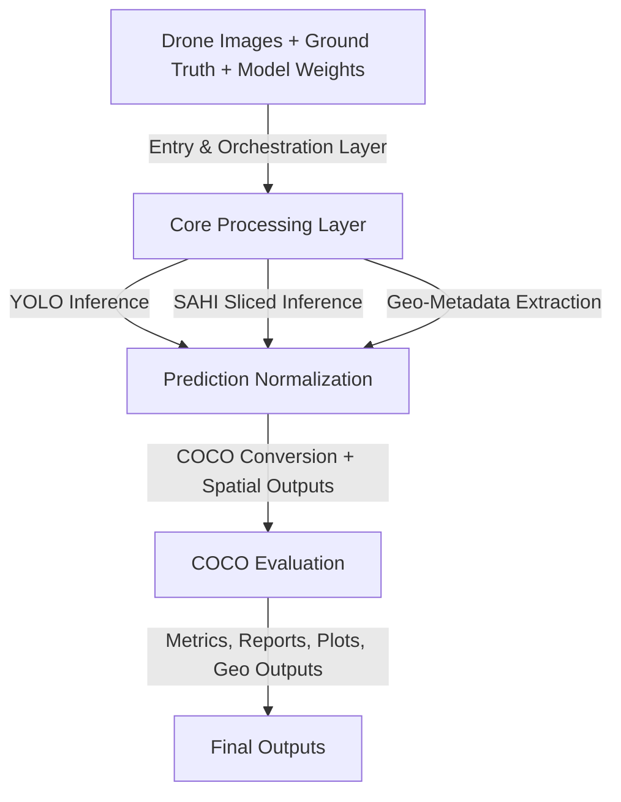

# 🏛️ Architecture

## 🌟 AgriDrone Vision Evaluation Pipeline

The **AgriDrone Vision Evaluation Pipeline** is a modular computer vision and evaluation system designed for high-resolution agricultural drone imagery. The architecture combines object detection inference, sliced inference for large images, prediction normalization, geospatial metadata extraction, COCO-compatible evaluation, and automated reporting.

The system is best described as a **research-grade batch processing pipeline** with modular service boundaries. While not currently a distributed production platform, its structure can evolve toward scalable MLOps or cloud-based execution.

---

## 🎯 Architectural Goals

The architecture was designed around the following goals:

- 📷 Process high-resolution drone imagery, including 4K images.
- 🤖 Support both direct YOLO inference and SAHI sliced inference.
- 🔄 Preserve reproducibility across model evaluation runs.
- 📊 Generate standardized COCO evaluation artifacts.
- 🌍 Integrate geospatial metadata into detection outputs.
- 📝 Produce machine-readable and human-readable reports.
- 📂 Keep outputs organized for technical documentation, scientific analysis, and portfolio presentation.

---

## 🏗️ High-Level Architecture



---

## 📚 Main Architectural Layers

### 1. Entry & Orchestration Layer

The orchestration layer is responsible for coordinating the complete workflow. In the current implementation, this layer is represented by the main script and command-line execution flow.

Typical responsibilities:

- Load paths and configuration parameters.
- Select inference mode.
- Load image directories and label directories.
- Trigger YOLO or SAHI inference.
- Trigger evaluation and reporting modules.
- Coordinate outputs across the filesystem.

Representative component:

```text
main.py
```

Current architectural pattern:

```text
script-driven batch orchestration
```

Recommended future pattern:

```text
configuration-driven modular pipeline
```

---

### 2. Core Processing Layer

The core processing layer contains the main domain logic of the system. It includes inference, normalization, geospatial extraction, COCO conversion, evaluation, metrics computation, and reporting.

Main modules:

- YOLO Inference Service
- SAHI Sliced Inference Service
- Prediction Normalization Module
- Geo-Metadata Extraction Module
- COCO Conversion Module
- COCO Evaluation Module
- YOLO Validation / Benchmarking Service
- Metrics Computation Module
- Reporting and Visualization Module

This layer is where most of the technical complexity exists.

---

### 3. Data & Output Layer

The data and output layer is filesystem-based. It stores both input references and generated artifacts.

Input artifacts:

- Raw drone images
- YOLO ground truth labels
- Model weights
- Class dictionary
- Configuration parameters

Generated artifacts:

- YOLO prediction `.txt` files
- Per-image metadata JSON
- COCO ground truth JSON
- COCO prediction JSON
- Global metrics JSON
- Per-class metrics JSON
- CSV metrics summaries
- Precision, recall, F1, AP50, and AP50:95 plots
- GeoJSON, CSV, and shapefile spatial exports
- Annotated image outputs

---

## ⚙️ Component Architecture

### CLI / Main Orchestrator

**Responsibility:** Coordinate execution of the pipeline.

Inputs:

- Dataset directory
- Model path
- Inference parameters
- Evaluation parameters
- Output directory

Outputs:

- Triggered inference and evaluation workflow
- Organized output artifacts

Technical concern:

The current orchestration approach is effective for research workflows but can become difficult to maintain as the pipeline grows. A configuration-driven architecture would reduce path fragility and improve reproducibility.

---

### YOLO Inference Service

**Responsibility:** Execute object detection on full-resolution or resized images using a trained YOLO model.

Inputs:

- Drone image
- YOLO model weights
- Confidence threshold
- Image size
- Class dictionary

Outputs:

- Bounding boxes
- Class IDs
- Confidence scores
- Normalized YOLO prediction files

Technical concern:

Direct YOLO inference is faster and simpler than sliced inference, but it may underperform on small objects when large images are resized before inference.

---

### SAHI Sliced Inference Service

**Responsibility:** Improve detection performance on high-resolution images by dividing images into overlapping slices and running inference on each slice.

Inputs:

- High-resolution drone image
- YOLO model weights
- Slice size
- Overlap ratio
- Confidence threshold

Outputs:

- Slice-level detections
- Full-image reconstructed detections
- Normalized predictions

Technical concern:

SAHI can improve recall for small objects, but it increases computational cost and introduces sensitivity to overlap settings, NMS behavior, and duplicate detections near slice boundaries.

---

### Prediction Normalization Module

**Responsibility:** Convert raw model detections into consistent prediction artifacts.

Responsibilities:

- Convert absolute bounding boxes into normalized YOLO coordinates.
- Validate class IDs against the class dictionary.
- Merge sliced detections into image-level predictions.
- Persist `.txt` prediction files.

Technical concern:

This module must be deterministic and thoroughly validated because downstream COCO evaluation depends directly on prediction format correctness.

---

### Geospatial Processing Service

**Responsibility:** Extract spatial metadata from drone images and generate geospatial outputs.

Responsibilities:

- Read EXIF/GPS metadata.
- Convert geographic coordinates into UTM coordinates.
- Compute altitude-related metadata such as AGL where available.
- Estimate field-of-view coverage.
- Export spatial outputs.

Outputs:

- Metadata JSON
- GeoJSON
- CSV
- Shapefiles

Technical concern:

Drone metadata may be incomplete or inconsistent. The system should handle missing GPS, DEM, or altitude metadata through fallback logic and explicit warnings.

---

### COCO Conversion Module

**Responsibility:** Convert YOLO annotations and predictions into COCO-compatible JSON artifacts.

Inputs:

- YOLO ground truth labels
- YOLO prediction files
- Image metadata
- Class dictionary

Outputs:

- `gt_coco.json`
- `pred_coco.json`

Technical concern:

COCO conversion is format-sensitive. Errors in image IDs, category IDs, bounding box formats, or confidence fields can invalidate evaluation results.

---


### YOLO Validation / Benchmarking Service

**Responsibility:** Execute reproducible YOLO-native validation using Ultralytics `model.val()` and persist benchmark metrics for experiment traceability.

Inputs:

- Dataset YAML
- Trained `best.pt` model
- Training metadata such as `args.yaml`
- Image size
- Batch size
- Confidence threshold
- GPU/CPU device
- ClearML configuration when enabled

Outputs:

- Global validation metrics
- Per-class metrics
- Timing statistics
- Validation summary JSON
- Ultralytics validation artifacts
- ClearML logs and artifacts

Technical concern:

This service is tightly coupled to Ultralytics output conventions and local filesystem paths. Temporary validation YAML files should be validated before execution, and per-class metrics should be stored as named objects rather than ambiguous arrays.

---
### COCO Evaluation Module

**Responsibility:** Evaluate object detection performance using COCO-style metrics through `pycocotools`.

Configured evaluation values:

```text
maxDets = [100, 1000, 3000]
```

Primary metrics:

- AP50
- AP50:95
- Precision
- Recall
- F1-score
- Per-class AP
- Per-class recall

Technical concern:

Metric interpretation must consider dataset imbalance, ambiguous labels, occlusions, small-object difficulty, and annotation quality.

---

### Reporting and Visualization Module

**Responsibility:** Generate structured reports and visual summaries of evaluation results.

Outputs:

- JSON reports
- CSV summaries
- Bar charts
- Metric comparison plots
- Per-class visualizations
- SAHI versus direct YOLO comparison artifacts

Technical concern:

Reporting should preserve raw metrics and avoid hiding model weaknesses behind aggregated averages only.

---

## 🚦 Data Flow

```text
1. User starts pipeline from CLI.
2. System loads configuration, model, images, labels, and class dictionary.
3. Training, validation, YOLO inference, or SAHI inference is executed depending on the selected CLI mode.
4. For validation, the benchmarking service can run `model.val()`, extract metrics, and log results.
5. Predictions are reconstructed and normalized.
6. EXIF/GPS metadata is extracted where available.
7. Ground truth and predictions are converted to COCO format.
8. pycocotools evaluation is executed when COCO evaluation is required.
9. Global and per-class metrics are generated.
10. JSON, CSV, plots, GeoJSON, and shapefiles are exported.
```

---

## 🗄️ Data Stores

The current implementation uses local filesystem storage.

Typical directories:

```text
data/
  images/
  labels/

models/
  trained_model.pt

outputs/
  predictions/
  metadata/
  coco/
  metrics/
  plots/
  geospatial/
  visualizations/
```

This is acceptable for research and batch experimentation. For production-scale deployment, storage should be abstracted behind interfaces or moved to object storage.

---

## 📊 Architectural Characteristics

### Strengths

- Modular separation of major technical responsibilities.
- Support for standard object detection evaluation through COCO metrics.
- Ability to compare direct YOLO inference against SAHI inference.
- Integrated geospatial output generation.
- Suitable for reproducible research and applied ML validation.
- Produces documentation-ready artifacts.

### Weaknesses

- Filesystem-based orchestration creates path fragility.
- No formal asynchronous task execution.
- No retry queue or failure recovery mechanism.
- Limited experiment tracking.
- Potential coupling between inference, evaluation, and reporting flows.
- Batch execution may become slow for large datasets.

---

## 🛠️ Current Maturity Level

```text
Advanced prototype / Research-grade engineering pipeline
```

The architecture is stronger than a proof of concept because it includes standardized evaluation, report generation, geospatial metadata processing, and support for high-resolution inference. However, it is not yet a fully productionized MLOps system.

---

## ⏩ Recommended Architectural Improvements

### 1. Configuration Layer

Introduce a formal configuration file such as:

```text
config/config.yaml
```

This should define:

- Model path
- Dataset paths
- Inference mode
- SAHI parameters
- Confidence thresholds
- Output locations
- Evaluation parameters
- Geospatial export options

---

### 2. Experiment Tracking

Add a run registry with:

```text
run_id
model_version
dataset_version
parameters
metrics
timestamp
```

Possible tools:

- MLflow
- Weights & Biases
- SQLite registry
- JSON run manifest

---

### 3. Parallel Processing

Add local parallelism for image-level processing using:

- `multiprocessing`
- `concurrent.futures`
- `joblib`
- GPU-aware batching

---

### 4. Service Boundary Refactoring

Recommended module boundaries:

```text
inference_service
evaluation_service
geospatial_service
reporting_service
configuration_service
storage_service
```

---

### 5. Structured Logging

Use structured logs with fields such as:

```json
{
  "run_id": "experiment_001",
  "image_id": "image_001",
  "stage": "inference",
  "status": "success",
  "latency_seconds": 2.41,
  "detections": 37
}
```

---

## 📎 Related Diagram

Recommended diagram file:

README reference:

```markdown

```
