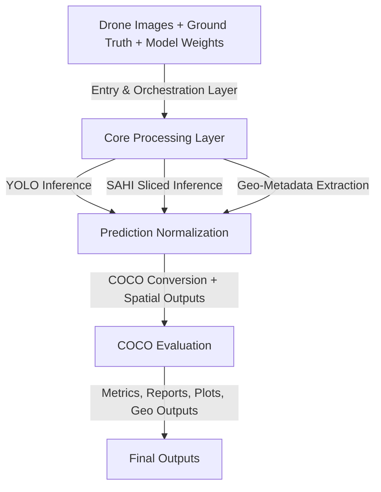
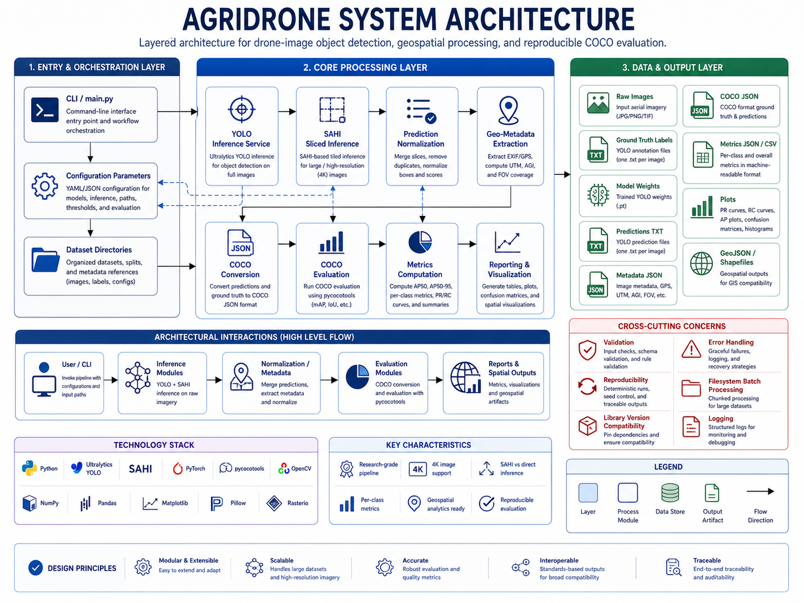

# 🏛️ Architecture

## 🔒 Public-Safe Documentation Notice

This document is part of a generalized and anonymized portfolio version of an agricultural computer vision system.

It does **not** include private datasets, client or institutional names, real field coordinates, proprietary model weights, production credentials, unpublished experimental results, internal reports, or operational deployment details.

All project names, dataset names, paths, metric values, coordinates, and identifiers shown here are illustrative, anonymized, or generalized for technical documentation purposes.

## 🌟 AgriDrone Vision Evaluation Pipeline

The **AgriDrone Vision Evaluation Pipeline** is a modular computer vision and evaluation system designed for high-resolution agricultural drone imagery. The architecture combines object detection inference, sliced inference for large images, prediction normalization, geospatial metadata extraction, COCO-compatible evaluation, and automated reporting.

The system is best described as a **research-grade batch processing pipeline** with modular service boundaries. While not currently a distributed production platform, its structure can evolve toward scalable MLOps or cloud-based execution.

---

## 🎯 Architectural Goals

The architecture was designed around the following goals:

- 📷 Process high-resolution drone imagery, including 4K images.
- 🤖 Support both direct YOLO inference and SAHI sliced inference.
- 🔄 Preserve reproducibility across model evaluation runs.
- 📊 Generate standardized COCO evaluation artifacts.
- 🌍 Integrate geospatial metadata into detection outputs.
- 📝 Produce machine-readable and human-readable reports.
- 📂 Keep outputs organized for technical documentation, scientific analysis, and portfolio presentation.

---

## 🏗️ High-Level Architecture



---

## 📚 Main Architectural Layers

### 1. Entry & Orchestration Layer

The orchestration layer is responsible for coordinating the complete workflow. In the generalized implementation pattern, this layer is represented by the main script and command-line execution flow.

Typical responsibilities:

- Load paths and configuration parameters.
- Select inference mode.
- Load image directories and label directories.
- Trigger YOLO or SAHI inference.
- Trigger evaluation and reporting modules.
- Coordinate outputs across the filesystem.

Representative component:

```text
main.py
```

Current architectural pattern:

```text
script-driven batch orchestration
```

Recommended future pattern:

```text
configuration-driven modular pipeline
```

---

### 2. Core Processing Layer

The core processing layer contains the main domain logic of the system. It includes inference, normalization, geospatial extraction, COCO conversion, evaluation, metrics computation, and reporting.

Main modules:

- YOLO Inference Service
- SAHI Sliced Inference Service
- YOLO / SAHI Inference and Geospatial Export Service
- Video Tracking Processor
- Object Counter
- Frame Annotation Renderer
- SRT Artifact Generator
- Prediction Normalization Module
- Geo-Metadata Extraction Module
- COCO Conversion Module
- COCO Evaluation Module
- YOLO Validation / Benchmarking Service
- Metrics Computation Module
- Reporting and Visualization Module

This layer is where most of the technical complexity exists.

---

### 3. Data & Output Layer

The data and output layer is filesystem-based. It stores both input references and generated artifacts.

Input artifacts:

- Raw drone images
- YOLO ground truth labels
- Model weights
- Class dictionary
- Configuration parameters

Generated artifacts:

- YOLO prediction `.txt` files
- Per-image metadata JSON
- COCO ground truth JSON
- COCO prediction JSON
- Global metrics JSON
- Per-class metrics JSON
- CSV metrics summaries
- Precision, recall, F1, AP50, and AP50:95 plots
- GeoJSON, CSV, and shapefile spatial exports
- Annotated image outputs
- JGW world files for styled JPEG rasters
- Optional GeoTIFF raster outputs

---

## ⚙️ Component Architecture

### CLI / Main Orchestrator

**Responsibility:** Coordinate execution of the pipeline.

Inputs:

- Dataset directory
- Model path
- Inference parameters
- Evaluation parameters
- Output directory

Outputs:

- Triggered inference and evaluation workflow
- Organized output artifacts

Technical concern:

The current orchestration approach is effective for research workflows but can become difficult to maintain as the pipeline grows. A configuration-driven architecture would reduce path fragility and improve reproducibility.

---

### YOLO Inference Service

**Responsibility:** Execute object detection on full-resolution or resized images using a trained YOLO model.

Inputs:

- Drone image
- YOLO model weights
- Confidence threshold
- Image size
- Class dictionary

Outputs:

- Bounding boxes
- Class IDs
- Confidence scores
- Normalized YOLO prediction files

Technical concern:

Direct YOLO inference is faster and simpler than sliced inference, but it may underperform on small objects when large images are resized before inference.

---

### SAHI Sliced Inference Service

**Responsibility:** Improve detection performance on high-resolution images by dividing images into overlapping slices and running inference on each slice.

Inputs:

- High-resolution drone image
- YOLO model weights
- Slice size
- Overlap ratio
- Confidence threshold

Outputs:

- Slice-level detections
- Full-image reconstructed detections
- Normalized predictions

Technical concern:

SAHI can improve recall for small objects, but it increases computational cost and introduces sensitivity to overlap settings, NMS behavior, and duplicate detections near slice boundaries.

---

### YOLO / SAHI Inference and Geospatial Export Service

**Responsibility:** Execute operational inference and export structured visual, metadata, and geospatial artifacts.

Inputs:

- Single image or image directory
- Trained `best.pt` model
- `img_size`, `slice_size`, `overlap_ratio`, and confidence threshold
- Class dictionary and class colors
- EXIF/GPS metadata embedded in source imagery
- Output directories

Outputs:

- Styled images with bounding boxes and class legends
- Per-image prediction and metadata JSON
- Class-level detection summaries
- GeoJSON outputs when coordinates are available
- QGIS-compatible CSV summaries
- Batch summary JSON and CSV
- Optional object crops

Technical concern:

This service currently combines inference, visualization, metadata extraction, and geospatial export in one operational flow. That is effective for research batch processing, but production usage would benefit from separating inference, post-processing, metadata enrichment, and export into independent service boundaries.

---

### Video Tracking Processor

**Responsibility:** Process video inputs using YOLO tracking and OpenCV frame processing.

Inputs:

- input video
- trained YOLO model
- confidence threshold
- class dictionary
- class color configuration
- output directory

Outputs:

- annotated video
- tracking summary JSON
- optional SRT frame summaries
- processing logs

Technical concern:

Video processing introduces temporal state. Unique object counts depend on the stability and availability of YOLO tracking IDs such as `box.id`.

Implementation contract:

```text
run_inference_video → safe_extract_bbox_info_video → ObjectCounter → draw_styled_boxes_and_summary_video → save_video_processing_results
```

---

### Object Counter

**Responsibility:** Maintain unique object counts across video frames.

Responsibilities:

- track unique IDs by class
- separate frame-level detections from unique-object counts
- handle missing or unstable tracking IDs
- persist class-level count summaries

Technical concern:

A detection count per frame is not equivalent to a unique-object count across a video. Counting logic must explicitly record how missing IDs or ID switches are handled.

---

### Frame Annotation Renderer

**Responsibility:** Render custom visual overlays on video frames.

Responsibilities:

- draw bounding boxes
- apply configured class colors
- render confidence labels and tracking IDs
- render total and per-class counters
- preserve original video color fidelity

Technical concern:

OpenCV uses BGR images while PIL and some model visualization paths may use RGB. Incorrect color conversion can degrade or distort video output.

---

### SRT Artifact Generator

**Responsibility:** Generate optional frame-aligned subtitle metadata.

Outputs may include:

```text
frame_index
start_time
end_time
class_counts
total_detections
unique_tracked_objects
```

Technical concern:

SRT outputs require synchronization with FPS, frame index, and processed-video duration.

### Augmentation Control Module

**Responsibility:** Control baseline and stochastic training augmentation policies.

Responsibilities:

- Distinguish baseline runs from augmented runs.
- Apply configured Ultralytics augmentation parameters.
- Apply Albumentations transforms when configured.
- Persist effective augmentation configuration.
- Prevent confusion between declared and actually applied augmentation behavior.

Technical concern:

A conceptual `augment=False` flag may not fully describe internal library behavior. Architecture documentation should treat augmentation settings as experiment-defining metadata.

---

### GPU Execution Layer

**Responsibility:** Manage single-GPU, DataParallel, and Distributed Data Parallel execution.

Responsibilities:

- Select execution mode.
- Launch DDP subprocesses when configured.
- Track device IDs and distributed rank where applicable.
- Stabilize CUDA memory across runs.
- Record memory-related runtime configuration.

Technical concern:

DDP provides distributed training execution, not persistent asynchronous processing. The architecture remains a synchronous batch pipeline unless a formal job queue or worker system is introduced.

### Prediction Normalization Module

**Responsibility:** Convert raw model detections into consistent prediction artifacts.

Responsibilities:

- Convert absolute bounding boxes into normalized YOLO coordinates.
- Validate class IDs against the class dictionary.
- Merge sliced detections into image-level predictions.
- Persist `.txt` prediction files.

Technical concern:

This module must be deterministic and thoroughly validated because downstream COCO evaluation depends directly on prediction format correctness.

---

### Geospatial Processing Service

**Responsibility:** Extract spatial metadata from drone images and generate geospatial outputs.

Responsibilities:

- Read EXIF/GPS metadata.
- Convert geographic coordinates into UTM coordinates.
- Compute altitude-related metadata such as AGL where available.
- Estimate field-of-view coverage.
- Export spatial outputs.

Outputs:

- Metadata JSON
- GeoJSON
- CSV
- Shapefiles

Technical concern:

Drone metadata may be incomplete or inconsistent. The system should handle missing GPS, DEM, or altitude metadata through fallback logic and explicit warnings.

---

### Raster Georeferencing Service

**Responsibility:** Convert styled detection images into georeferenced raster artifacts for GIS tools.

Inputs:

- original image metadata
- styled JPEG output
- GPS/EXIF metadata
- altitude/FOV assumptions when available
- optional `GPSImgDirection`
- target CRS assumptions

Outputs:

- styled JPEG with copied EXIF/XMP metadata
- `.jgw` world file
- optional GeoTIFF
- raster georeferencing manifest

Technical concern:

A `.jgw` file stores an affine transform but does not store CRS information. The CRS and units must be persisted separately to avoid spatial misinterpretation.

---

### External GIS Tooling Layer

**Responsibility:** Integrate system-level GIS tools required for metadata preservation, raster conversion, and QGIS automation.

Representative tools:

```text
ExifTool
GDAL / OGR
gdal_translate
gdalbuildvrt
QGIS / PyQGIS
```

Technical concern:

These are system-level dependencies, not ordinary Python packages. They affect environment reproducibility, Dockerization, deployment, and failure handling.

---

### QGIS Automation Module

**Responsibility:** Automate loading of georeferenced raster outputs into QGIS.

Behavior:

- iterate over styled `.jpg` outputs
- ignore `.jgw` files as explicit layers
- allow QGIS to apply `.jgw` sidecar files implicitly
- optionally load GeoTIFF outputs directly

Technical concern:

EXIF GPS metadata alone is not sufficient for QGIS raster positioning. QGIS raster georeferencing should be based on `.jgw` or GeoTIFF outputs.

### COCO Conversion Module

**Responsibility:** Convert YOLO annotations and predictions into COCO-compatible JSON artifacts.

Inputs:

- YOLO ground truth labels
- YOLO prediction files
- Image metadata
- Class dictionary

Outputs:

- `gt_coco.json`
- `pred_coco.json`

Technical concern:

COCO conversion is format-sensitive. Errors in image IDs, category IDs, bounding box formats, or confidence fields can invalidate evaluation results.

---


### YOLO Validation / Benchmarking Service

**Responsibility:** Execute reproducible YOLO-native validation using Ultralytics `model.val()` and persist benchmark metrics for experiment traceability.

Inputs:

- Dataset YAML
- Trained `best.pt` model
- Training metadata such as `args.yaml`
- Image size
- Batch size
- Confidence threshold
- GPU/CPU device
- ClearML configuration when enabled

Outputs:

- Global validation metrics
- Per-class metrics
- Timing statistics
- Validation summary JSON
- Ultralytics validation artifacts
- ClearML logs and artifacts

Technical concern:

This service is tightly coupled to Ultralytics output conventions and local filesystem paths. Temporary validation YAML files should be validated before execution, and per-class metrics should be stored as named objects rather than ambiguous arrays.

---
### COCO Evaluation Module

**Responsibility:** Evaluate object detection performance using COCO-style metrics through `pycocotools`.

Configured evaluation values:

```text
maxDets = [100, 1000, 3000]
```

Primary metrics:

- AP50
- AP50:95
- Precision
- Recall
- F1-score
- Per-class AP
- Per-class recall

Technical concern:

Metric interpretation must consider dataset imbalance, ambiguous labels, occlusions, small-object difficulty, and annotation quality.

---

### Reporting and Visualization Module

**Responsibility:** Generate structured reports and visual summaries of evaluation results.

Outputs:

- JSON reports
- CSV summaries
- Bar charts
- Metric comparison plots
- Per-class visualizations
- SAHI versus direct YOLO comparison artifacts

Technical concern:

Reporting should preserve raw metrics and avoid hiding model weaknesses behind aggregated averages only.

---

## 🚦 Data Flow

```text
1. User starts pipeline from CLI.
2. System loads configuration, model, images, labels, and class dictionary.
3. Training, validation, YOLO inference, or SAHI inference is executed depending on the selected CLI mode.
4. For validation, the benchmarking service can run `model.val()`, extract metrics, and log results.
5. Predictions are reconstructed and normalized.
6. EXIF/GPS metadata is extracted where available.
7. Ground truth and predictions are converted to COCO format.
8. pycocotools evaluation is executed when COCO evaluation is required.
9. Global and per-class metrics are generated.
10. JSON, CSV, styled images, GeoJSON, QGIS summaries, and shapefiles are exported.
11. Styled JPEG raster outputs can be copied with EXIF/XMP metadata, paired with `.jgw` world files, optionally converted to GeoTIFF, and batch-loaded into QGIS through PyQGIS.
12. Video inference can process frames through `model.track()`, count unique objects using tracking IDs, render annotated video, and optionally export SRT frame summaries.
```

---

## 🗄️ Data Stores

The generalized implementation pattern uses local filesystem storage.

Typical directories:

```text
data/
  images/
  labels/

models/
  trained_model.pt

outputs/
  predictions/
  metadata/
  coco/
  metrics/
  plots/
  geospatial/
  visualizations/
```

This is acceptable for research and batch experimentation. For production-scale deployment, storage should be abstracted behind interfaces or moved to object storage.

---

## 📊 Architectural Characteristics

### Strengths

- Modular separation of major technical responsibilities.
- Support for standard object detection evaluation through COCO metrics.
- Ability to compare direct YOLO inference against SAHI inference.
- Integrated geospatial output generation.
- Suitable for reproducible research and applied ML validation.
- Produces documentation-ready artifacts.

### Weaknesses

- Filesystem-based orchestration creates path fragility.
- No formal asynchronous task execution.
- No retry queue or failure recovery mechanism.
- Limited experiment tracking.
- Potential coupling between inference, evaluation, and reporting flows.
- Batch execution may become slow for large datasets.

---

## 🛠️ Current Maturity Level

```text
Advanced prototype / Research-grade engineering pipeline
```

The architecture is stronger than a proof of concept because it includes standardized evaluation, report generation, geospatial metadata processing, and support for high-resolution inference. However, it is not yet a fully productionized MLOps system.

---

## ⏩ Recommended Architectural Improvements

### 1. Configuration Layer

Introduce a formal configuration file such as:

```text
config/config.yaml
```

This should define:

- Model path
- Dataset paths
- Inference mode
- SAHI parameters
- Confidence thresholds
- Output locations
- Evaluation parameters
- Geospatial export options

---

### 2. Experiment Tracking

Add a run registry with:

```text
run_id
model_version
dataset_version
parameters
metrics
timestamp
```

Possible tools:

- MLflow
- Weights & Biases
- SQLite registry
- JSON run manifest

---

### 3. Parallel Processing

Add local parallelism for image-level processing using:

- `multiprocessing`
- `concurrent.futures`
- `joblib`
- GPU-aware batching

---

### 4. Service Boundary Refactoring

Recommended module boundaries:

```text
inference_service
evaluation_service
geospatial_service
reporting_service
configuration_service
storage_service
```

---

### 5. Structured Logging

Use structured logs with fields such as:

```json
{
  "run_id": "experiment_001",
  "image_id": "image_001",
  "stage": "inference",
  "status": "success",
  "latency_seconds": 2.41,
  "detections": 37
}
```

---

## 🧠 Implementation-Level Architecture Notes

### Video Tracking Boundary

Video inference should be treated as a distinct inference path because it introduces temporal state, frame decoding, tracking IDs, overlay rendering, video encoding, and optional SRT generation.

Recommended architectural boundary:

```text
VideoCapture
    ↓
YOLO model.track()
    ↓
ObjectCounter
    ↓
FrameAnnotationRenderer
    ↓
VideoWriter + JSON/SRT serializers
```

The system remains synchronous and frame-based unless a formal video job queue or worker layer is introduced.

### Video Artifact Consistency

Annotated videos, JSON summaries, and SRT outputs should be promoted to final paths only after the video job completes successfully. Long-running video jobs can otherwise leave partial but misleading artifacts.

### Video Function-Level Boundary

The video inference path should be treated as a sequence of explicit responsibilities:

```text
run_inference_video
    ↓
safe_extract_bbox_info_video
    ↓
ObjectCounter
    ↓
draw_styled_boxes_and_summary_video
    ↓
save_video_processing_results
```

Architectural implications:

- bounding-box extraction should be isolated from rendering
- object counting should be isolated from frame annotation
- persistence should convert NumPy/tensor values into JSON-safe types
- video resources should be finalized independently of inference success or failure
- output promotion should happen only when MP4, JSON, and SRT artifacts are consistent

### Video Configuration Normalization Layer

The video path should normalize user/configuration inputs before execution:

```text
JSON label keys      → integer class IDs
JSON color keys      → integer class IDs
project names        → sanitized filesystem names
model selection path → resolved checkpoint lineage
font path            → configured font or fallback
```

This reduces failures caused by JSON key typing, path drift, missing colors, and environment-specific font availability.

### GPU Runtime Assumption for Video

Video inference should document the full GPU runtime assumption:

```text
NVIDIA driver
CUDA
cuDNN
PyTorch build matching CUDA version
Ultralytics runtime compatibility
```

CUDA alone is not a complete deployment contract for GPU-accelerated video inference.

### Multi-GPU Training Boundary

The training service may execute under single-GPU mode, PyTorch DataParallel, or Distributed Data Parallel. This is not just an infrastructure detail: it affects metric collection, checkpoint ownership, CUDA memory pressure, reproducibility, and output paths.

Architectural implication:

```text
Training Service
  ├── Single GPU execution
  ├── DataParallel execution
  └── Distributed Data Parallel execution
        └── requires explicit checkpoint and metric lineage tracking
```

### Post-Training Metric Recovery

The conceptual training flow is usually described as:

```text
train model → receive metrics → persist summary
```

The implementation may require a defensive branch:

```text
train model
   ├── metrics returned → persist directly
   └── metrics missing / None → load generated best.pt → run validation → recover metrics
```

This behavior should be treated as part of the architecture because it affects the source of truth for metrics and model comparison.

### Checkpoint Lineage and Ownership

Every validation or inference run should record the exact checkpoint used. At minimum, summaries should include:

```text
run_id
training_run_id
model_path
checkpoint_hash_or_size
source_results_csv
args_yaml_path
selected_metric_row
img_size
model_family
seed
```

Without this lineage, a multi-run experiment can accidentally validate a stale or incorrect `best.pt`.

### Local-First Artifact Policy

ClearML improves experiment tracking, but the local artifact store should remain authoritative. The system should persist local JSON/CSV summaries before or independently from remote logging. ClearML failures should be captured as tracking failures, not core validation or inference failures.

### Baseline, Augmentation, and Runtime Lineage

The architecture should treat the following as first-class experiment metadata:

```text
augmentation_policy
effective_augmentation_parameters
multi_gpu_mode
distributed_processes
cuda_memory_config
ultralytics_output_dir
project_name_sanitized
```

These fields are necessary because the implementation includes baseline/augmented run separation, DP/DDP behavior, possible Ultralytics folder auto-increment, and CUDA memory stabilization.

### Distributed-Training-Enabled, Not Fully Distributed

The system includes distributed training capabilities through PyTorch DDP, but the overall platform is not a distributed production system. It remains a research-grade batch pipeline with distributed GPU execution in the training layer.


---

## 📎 Related Diagram

Recommended diagram file:

README reference:

```markdown

```
