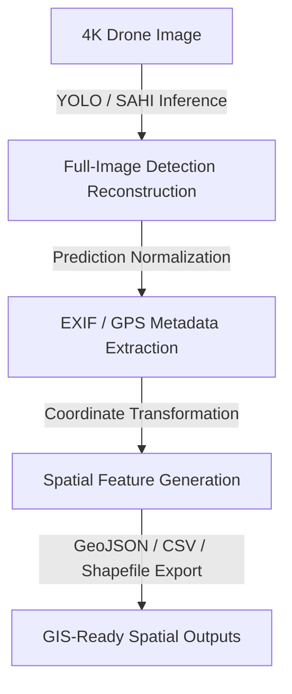

# 🌍 Georeferenced Detection & Shapefile Generation Pipeline

> From high-resolution drone-image inference to GIS-ready spatial outputs for agricultural computer vision workflows.

---

## 🌟 Overview

The **Georeferenced Detection & Shapefile Generation Pipeline** is a specialized workflow within the `agridrone-vision-evaluation-pipeline` project. Its purpose is to transform object detection results generated from high-resolution drone imagery into geospatial artifacts that can be used in GIS tools, spatial analytics workflows, precision agriculture dashboards, and downstream reporting systems.

This pipeline connects three technical domains:

1. **Computer Vision Inference**
   - 🤖 YOLO object detection
   - 🖼️ SAHI sliced inference for 4K / high-resolution drone imagery
   - 📏 Bounding box reconstruction and normalization

2. **Geospatial Metadata Processing**
   - 📍 EXIF / GPS metadata extraction
   - 🌐 Coordinate conversion
   - 🗺️ Spatial feature construction
   - ⛰️ Optional terrain-aware altitude processing

3. **GIS Artifact Generation**
   - 🗂️ GeoJSON
   - 📊 CSV spatial summaries
   - 🗺️ ESRI Shapefile outputs
   - 🛠️ Optional PostGIS-ready records

The result is a reproducible workflow that converts detections from image space into structured spatial outputs ready for geospatial analysis.


>The system assumes a consistent projected coordinate system for spatial outputs.
Current implementations are optimized for datasets captured within a specific geographic region,
and adaptation may be required when applying the pipeline to other geographic contexts.
---


## 🔗 Relationship to the YOLO / SAHI Inference Export Pipeline

This shapefile-focused pipeline consumes outputs generated by the operational inference/export workflow.

Upstream inference/export artifacts may include:

```text
styled images
per-image prediction JSON
class summaries
EXIF/GPS metadata
GeoJSON
QGIS CSV
batch summaries
```

This document focuses on the downstream GIS transformation stage: turning spatially enriched detections into structured geospatial features, shapefile schemas, QA reports, and GIS-ready artifacts.

Recommended upstream document:

```text
docs/yolo-sahi-inference-geospatial-export-pipeline.md
```

---

## 🌟 Why This Pipeline Matters

Standard object detection pipelines usually stop at predictions such as:

```text
class_id confidence x_min y_min x_max y_max
```

However, in agricultural drone-based analysis, this is not enough. A detection is only operationally useful if it can be associated with:

- 📍 Where it was detected
- 🖼️ Which image produced it
- 📊 What confidence score it had
- 🏷️ What class was identified
- 🌾 Whether it belongs to a specific field zone, row, block, or spatial area
- 🗺️ Whether it can be exported into GIS-compatible formats

This pipeline extends model inference into **geospatial intelligence**.

Instead of producing only bounding boxes, it produces spatial artifacts that can be used for:

- 🌾 Precision agriculture analysis
- 🌱 Crop monitoring
- 🐛 Pest or disease hotspot mapping
- 📊 Spatial distribution analysis
- 🛠️ Field inspection planning
- 🗺️ GIS visualization
- 📚 Research-grade reporting
- 📈 Model evaluation with geographic context

---

## 🏗️ High-Level Pipeline



---

## 🔑 Core Responsibilities

The pipeline is responsible for:

- 📂 Loading high-resolution drone images
- 🤖 Executing direct YOLO or SAHI sliced inference
- 🖼️ Reconstructing detections from image slices into full-image coordinates
- 📏 Exporting normalized prediction files
- 📍 Extracting geospatial metadata from drone imagery
- 🌐 Transforming detections from image coordinates into spatial references
- 🗺️ Generating point and polygon spatial features
- 🗂️ Exporting GIS-compatible files
- ✅ Validating spatial outputs
- ⚠️ Handling missing or incomplete metadata
- 🔄 Producing reproducible geospatial artifacts

---

## 📥 Input Requirements

### 1. Drone Images

Expected input:

```text
data/images/
├── image_001.jpg
├── image_002.jpg
└── image_003.jpg
```

Supported formats may include:

- `.jpg`
- `.jpeg`
- `.png`
- `.tif`
- `.tiff`

For drone workflows, images are typically high-resolution, commonly 4K or larger.

---

### 2. Model Weights

A trained YOLO model is required:

```text
models/
└── trained_model.pt
```

The model should be trained on classes relevant to the agricultural use case, such as crops, fruits, weeds, pests, disease symptoms, or other field-level targets.

---

### 3. Ground Truth Labels (Optional)

Ground truth is not strictly required for shapefile generation, but it may be used for validation or evaluation.

Expected YOLO label format:

```text
<class_id> <x_center> <y_center> <width> <height>
```

Example:

```text
0 0.4215 0.5531 0.0420 0.0385
```

---

### 4. Class Dictionary

A class dictionary maps model class IDs to human-readable labels.

Example:

```json
{
  "0": "crop",
  "1": "weed",
  "2": "disease_symptom",
  "3": "fruit"
}
```

This mapping is required to generate meaningful GIS attributes.

---

### 5. Inference Parameters

Recommended parameters:

```yaml
inference:
  mode: sahi
  img_size: 1280
  confidence_threshold: 0.25
  device: cuda
  batch_mode: true
```

---

### 6. SAHI Parameters

SAHI is especially important for high-resolution drone imagery where small objects may disappear during resizing.

Recommended configuration:

```yaml
sahi:
  enabled: true
  slice_size: 1024
  overlap_ratio: 0.2
  postprocess_type: nms
  postprocess_match_threshold: 0.5
```

---

### 7. EXIF / GPS Metadata

The pipeline expects drone images to contain geospatial metadata when available.

Useful fields include:

- latitude
- longitude
- altitude
- timestamp
- camera model
- image width
- image height
- focal length
- orientation / heading if available

---

### 8. Optional DEM / Terrain Source

A digital elevation model may be used to estimate terrain-aware altitude or approximate AGL.

```text
AGL = Drone Altitude - Terrain Elevation
```

This is useful when spatial projection requires altitude-aware correction.

---

## 📈 Detailed Workflow

### Step 1: Load Drone Image and Metadata

The pipeline starts by loading a high-resolution drone image and reading its associated metadata.

Responsibilities:

- ✅ Verify image exists
- ✅ Validate image format
- ✅ Read image dimensions
- ✅ Load EXIF metadata
- ✅ Extract GPS fields if available
- ✅ Initialize image-level metadata record

Example metadata structure:

```json
{
  "image_id": "image_001",
  "filename": "image_001.jpg",
  "width": 3840,
  "height": 2160,
  "latitude": -33.12345,
  "longitude": -70.12345,
  "altitude": 120.5,
  "timestamp": "2026-04-12T10:35:21Z"
}
```

---

### Step 2: Select Inference Mode

The system supports two inference modes:

#### Direct YOLO Inference

Best suited for:

- Smaller images
- Larger objects
- Faster execution
- Simple inference workflows

Limitations:

- Small objects may be lost during resizing
- Lower recall in dense aerial images
- Less suitable for 4K imagery with fine-grained targets

#### SAHI Sliced Inference

Best suited for:

- 4K or larger images
- Small-object detection
- Dense scenes
- Aerial imagery
- Precision agriculture inspection

Trade-offs:

- Higher computational cost
- More post-processing complexity
- Possible duplicate detections near slice borders
- Sensitivity to slice size and overlap ratio

---

### Step 3: Generate Image Slices with SAHI

When SAHI mode is enabled, the image is divided into overlapping tiles.

```text
4K Image
 ├── Slice 1
 ├── Slice 2
 ├── Slice 3
 └── ...
```

Each slice is processed independently by the YOLO model.

Important parameters:

- `slice_size`
- `overlap_ratio`
- `confidence_threshold`
- `postprocess_match_threshold`

SAHI helps preserve local object detail by avoiding aggressive downscaling of the full image.

---

### Step 4: Run YOLO Inference

The YOLO model runs either on:

1. the full image, or
2. each generated SAHI slice

The raw output typically includes:

- class ID
- confidence score
- bounding box coordinates
- image or slice reference

Example raw detection:

```json
{
  "class_id": 1,
  "confidence": 0.87,
  "bbox": [1250, 730, 1325, 805]
}
```

---

### Step 5: Reconstruct Full-Image Detections

For SAHI inference, detections must be mapped back from slice-local coordinates to full-image coordinates.

This step handles:

- Coordinate offset correction
- Slice-to-image coordinate reconstruction
- Duplicate detection removal
- NMS or equivalent post-processing
- Filtering invalid bounding boxes

Example:

```text
slice_bbox + slice_origin_offset → full_image_bbox
```

This step is critical. If reconstruction is wrong, all downstream spatial outputs will be spatially inaccurate.

---

### Step 6: Normalize and Validate Predictions

After reconstruction, predictions are normalized and exported.

Validation checks include:

- Class ID exists in the class dictionary
- Confidence score is valid
- Bounding box is inside image bounds
- Box width and height are positive
- No malformed coordinates
- No empty or corrupted prediction records

Example normalized YOLO prediction:

```text
1 0.3354 0.4821 0.0195 0.0238 0.87
```

Recommended output:

```text
outputs/predictions/
├── image_001.txt
├── image_002.txt
└── image_003.txt
```

---

### Step 7: Extract Georeferencing Metadata

The geospatial layer extracts metadata from drone imagery.

Potential metadata sources:

- EXIF GPS fields
- Drone flight metadata
- Camera parameters
- External metadata files
- Optional DEM / terrain source

Important metadata fields:

```json
{
  "latitude": -33.12345,
  "longitude": -70.12345,
  "altitude": 120.5,
  "camera_heading": 92.0,
  "timestamp": "2026-04-12T10:35:21Z"
}
```

If metadata is missing, the pipeline should either:

- Generate partial outputs
- Mark spatial fields as unavailable
- Skip spatial transformation
- Log the issue clearly

---

### Step 8: Compute Spatial Coordinates

This step converts image-space detections into spatial features.

The process may include:

1. Compute detection center in image coordinates
2. Estimate relative position inside the image footprint
3. Transform GPS coordinates to projected CRS
4. Calculate UTM coordinates
5. Estimate field-of-view footprint
6. Optionally adjust using AGL or DEM
7. Assign spatial coordinates to each detection

Example spatial feature attributes:

```json
{
  "image_id": "image_001",
  "class_id": 1,
  "class_name": "weed",
  "confidence": 0.87,
  "pixel_bbox": [1250, 730, 1325, 805],
  "utm_x": 352411.42,
  "utm_y": 6321820.11,
  "crs": "EPSG:32719"
}
```

---

### Step 9: Build Spatial Features

The pipeline can generate several feature types.

#### Point Features

Usually represent the center of each detection.

Useful for:

- Hotspot mapping
- Density analysis
- Count aggregation
- Simple GIS overlays

Example:

```geojson
{
  "type": "Feature",
  "geometry": {
    "type": "Point",
    "coordinates": [-70.12345, -33.12345]
  },
  "properties": {
    "class_name": "weed",
    "confidence": 0.87,
    "image_id": "image_001"
  }
}
```

---

#### Bounding Box Polygons

Represent the approximate spatial extent of each detection.

Useful for:

- Spatial coverage estimation
- Object footprint analysis
- Overlay visualization
- GIS inspection workflows

---

#### Image Footprint Polygons

Represent the approximate geographic coverage of the source image.

Useful for:

- Image coverage validation
- Field mapping
- Spatial QA
- Overlap inspection

---

### Step 10: Export GIS Artifacts

The final spatial outputs can include:

```text
outputs/geospatial/
├── detections.geojson
├── detections.csv
├── detections.shp
├── detections.dbf
├── detections.shx
├── detections.prj
└── metadata.json
```

#### GeoJSON

Best for:

- Web maps
- Lightweight spatial exchange
- Debugging
- Dashboards
- Direct inspection

#### CSV

Best for:

- Tabular analysis
- Pandas workflows
- Reporting
- Quick validation

#### Shapefile

Best for:

- QGIS
- ArcGIS
- Legacy GIS workflows
- Spatial data exchange

Important shapefile constraints:

- Field names are limited in length
- Attribute types must be simple
- Geometry type should be consistent
- Multiple files are generated as part of one shapefile dataset

A shapefile usually includes:

```text
detections.shp
detections.shx
detections.dbf
detections.prj
```

---

## Step 11: Generate Spatial QA and Reports

Recommended QA outputs include:

- Count by class
- Detections per image
- Missing metadata report
- Invalid coordinate report
- Out-of-bounds detection report
- Confidence distribution
- Spatial coverage summary
- Optional overlay plots

Example QA summary:

```json
{
  "total_images": 120,
  "images_with_gps": 116,
  "images_without_gps": 4,
  "total_detections": 3842,
  "exported_spatial_features": 3721,
  "skipped_features": 121
}
```

---

## Output Artifacts

### Prediction Outputs

```text
outputs/predictions/
└── *.txt
```

### Metadata Outputs

```text
outputs/metadata/
└── *.json
```

### Spatial Outputs

```text
outputs/geospatial/
├── detections.geojson
├── detections.csv
├── detections.shp
├── detections.dbf
├── detections.shx
├── detections.prj
```

### QA Outputs

```text
outputs/reports/
├── spatial_summary.json
├── missing_metadata_report.csv
├── invalid_features.csv
└── geospatial_export_log.json
```

---

## Recommended Repository Structure

```text
agridrone-vision-evaluation-pipeline/
│
├── src/
│   ├── inference/
│   │   ├── predict_yolo.py
│   │   └── predict_sahi.py
│   │
│   ├── geospatial/
│   │   ├── exif_reader.py
│   │   ├── gps_parser.py
│   │   ├── coordinate_transform.py
│   │   ├── footprint_estimator.py
│   │   ├── spatial_features.py
│   │   └── shapefile_exporter.py
│   │
│   ├── reporting/
│   │   ├── spatial_qa.py
│   │   └── plots.py
│   │
│   └── utils/
│       ├── validation.py
│       ├── logging_utils.py
│       └── file_utils.py
│
├── data/
│   ├── images/
│   └── labels/
│
├── models/
│   └── trained_model.pt
│
├── outputs/
│   ├── predictions/
│   ├── metadata/
│   ├── geospatial/
│   └── reports/
│
├── config/
│   └── geospatial-pipeline.example.yaml
│
└── docs/
    └── georeferenced-detection-shapefile-pipeline.md
```

---

## Recommended Configuration

```yaml
project:
  name: agridrone-vision-evaluation-pipeline
  pipeline: georeferenced-detection-shapefile-generation
  run_id: geo_run_001

paths:
  images_dir: data/images
  labels_dir: data/labels
  model_weights: models/trained_model.pt
  output_dir: outputs

inference:
  mode: sahi
  img_size: 1280
  confidence_threshold: 0.25
  device: cuda

sahi:
  enabled: true
  slice_size: 1024
  overlap_ratio: 0.2
  postprocess_type: nms
  postprocess_match_threshold: 0.5

geospatial:
  enabled: true
  source_crs: EPSG:4326
  target_crs: auto_utm
  use_exif_gps: true
  use_dem: false
  dem_path: null
  export_point_features: true
  export_bbox_polygons: true
  export_image_footprints: false

outputs:
  save_predictions_txt: true
  save_metadata_json: true
  save_geojson: true
  save_csv: true
  save_shapefile: true
  save_qa_reports: true

quality:
  skip_images_without_gps: false
  allow_partial_spatial_export: true
  validate_class_ids: true
  validate_bbox_bounds: true
  log_invalid_features: true
```

---

## Example Usage

```bash
python src/main.py \
  --pipeline geospatial \
  --config config/geospatial-pipeline.example.yaml
```

For SAHI-based inference:

```bash
python src/main.py \
  --pipeline geospatial \
  --inference-mode sahi \
  --config config/geospatial-pipeline.example.yaml
```

For direct YOLO inference:

```bash
python src/main.py \
  --pipeline geospatial \
  --inference-mode yolo \
  --config config/geospatial-pipeline.example.yaml
```

---

## Shapefile Schema Design

Recommended shapefile attributes:

| Field | Description |
|---|---|
| `det_id` | Unique detection identifier |
| `image_id` | Source image identifier |
| `class_id` | Numeric class ID |
| `class_name` | Human-readable class label |
| `conf` | Confidence score |
| `x_min` | Pixel-space bounding box x-min |
| `y_min` | Pixel-space bounding box y-min |
| `x_max` | Pixel-space bounding box x-max |
| `y_max` | Pixel-space bounding box y-max |
| `lat` | Latitude |
| `lon` | Longitude |
| `utm_x` | Projected X coordinate |
| `utm_y` | Projected Y coordinate |
| `crs` | Coordinate reference system |
| `run_id` | Experiment or processing run ID |
| `timestamp` | Image or processing timestamp |

Because shapefile field names are constrained, production exports may need shortened names:

| Full Field | Shapefile Field |
|---|---|
| `detection_id` | `det_id` |
| `confidence` | `conf` |
| `class_name` | `cls_name` |
| `coordinate_reference_system` | `crs` |
| `source_image_id` | `img_id` |

---

## Production-Oriented Architecture

A production-grade version should not be implemented as a single monolithic script. The recommended architecture separates concerns into dedicated stages:

```text
Image Ingestion
     │
     ▼
Inference Workers
     │
     ▼
SAHI Reconstruction / Post-processing
     │
     ▼
Geospatial Enrichment Service
     │
     ▼
Spatial Export Service
     │
     ▼
Artifact Storage / GIS Integration
```

---

## Production Components

### 1. Image Ingestion

Responsibilities:

- Register new images
- Validate file format
- Extract initial metadata
- Assign job ID
- Store raw image reference

### 2. Inference Workers

Responsibilities:

- Run YOLO or SAHI inference
- Use GPU acceleration when available
- Process images in batch
- Persist raw predictions

### 3. Reconstruction and Post-processing

Responsibilities:

- Merge SAHI detections
- Apply NMS
- Validate bounding boxes
- Normalize predictions

### 4. Geospatial Enrichment Service

Responsibilities:

- Read GPS/EXIF metadata
- Transform coordinates
- Compute spatial attributes
- Handle DEM / AGL logic if available

### 5. Spatial Export Service

Responsibilities:

- Generate GeoJSON
- Generate CSV
- Generate shapefile datasets
- Optionally prepare PostGIS records

### 6. Artifact Storage

Responsibilities:

- Persist all generated artifacts
- Maintain run metadata
- Preserve reproducibility
- Store logs and QA reports

---

## Error and Quality Handling

| Risk | Recommended Handling |
|---|---|
| Missing GPS metadata | Generate non-spatial detection output and log missing spatial fields |
| Invalid CRS | Stop spatial export for affected image and record error |
| DEM unavailable | Continue with approximate altitude if allowed |
| Duplicate slice detections | Apply NMS or SAHI post-processing |
| Out-of-bounds boxes | Skip invalid feature and log record |
| Invalid class ID | Warn, skip, or map to unknown class |
| Shapefile field limitations | Normalize field names before export |
| Partial export failure | Continue remaining exports and save QA log |

---

## Observability Recommendations

For production-oriented use, each processed image should generate structured logs.

Example:

```json
{
  "run_id": "geo_run_001",
  "image_id": "image_001",
  "stage": "geospatial_export",
  "status": "success",
  "detections": 42,
  "spatial_features": 42,
  "crs": "EPSG:32719",
  "duration_seconds": 1.84
}
```

Recommended metrics:

- Images processed
- Images with GPS metadata
- Images without GPS metadata
- Detections generated
- Spatial features exported
- Invalid features skipped
- Shapefile export failures
- Average processing time per image
- Total batch duration

---

## Testing Strategy

Recommended test cases:

### Image and Metadata Tests

- Image exists
- Image can be opened
- EXIF can be parsed
- GPS fields are valid
- Missing GPS is handled safely

### Detection Tests

- Bounding boxes are within image bounds
- Class IDs exist in dictionary
- Confidence scores are valid
- SAHI reconstructed boxes are valid

### Geospatial Tests

- CRS is valid
- UTM conversion works
- Coordinate values are within expected range
- Missing DEM does not break pipeline when optional

### Export Tests

- GeoJSON is valid
- CSV contains expected columns
- Shapefile components are generated
- Shapefile schema respects field constraints
- Invalid features are logged

---

## Limitations

This pipeline depends heavily on metadata quality. If drone images do not include reliable GPS or camera metadata, spatial outputs may be incomplete or approximate.

Known limitations include:

- GPS precision may vary by drone hardware
- EXIF metadata may be missing or stripped during image export
- DEM-based AGL estimation may not be available
- Image-to-ground projection may be approximate without full camera calibration
- SAHI post-processing may create duplicate or fragmented detections
- Shapefile format has field length and schema limitations
- Local filesystem workflows may not scale to large production volumes without orchestration

---

## Future Improvements

Recommended improvements:

- Integrate PostGIS export
- Add spatial indexing
- Support cloud object storage
- Add queue-based processing
- Support distributed GPU inference workers
- Integrate DEM-based terrain correction
- Add camera calibration support
- Add orthomosaic support
- Add spatial clustering and density analysis
- Add automated QGIS style files
- Add MLflow or experiment registry integration
- Add full geospatial QA dashboards

---

## Portfolio Summary

This pipeline demonstrates how a computer vision system can move beyond simple object detection by converting model predictions into geospatial artifacts suitable for precision agriculture workflows.

It combines high-resolution drone imagery, YOLO/SAHI inference, metadata extraction, coordinate transformation, spatial feature construction, and GIS-compatible exports. The result is a reproducible, research-grade workflow capable of generating spatial outputs such as GeoJSON, CSV, and shapefiles from agricultural drone image detections.

This component highlights applied experience in:

- Computer vision
- High-resolution image inference
- SAHI sliced inference
- Geospatial data processing
- GIS artifact generation
- Reproducible ML workflows
- Production-oriented batch pipeline design

---

## Privacy and Confidentiality Notice

This documentation describes the technical architecture and methodology of a geospatial computer vision pipeline in a generalized form.

It does not expose:

- Confidential datasets
- Private field locations
- Client names
- Production credentials
- Proprietary model weights
- Internal infrastructure details
- Sensitive geospatial coordinates

Any sample data included in a public repository should be anonymized, synthetic, or publicly shareable.
