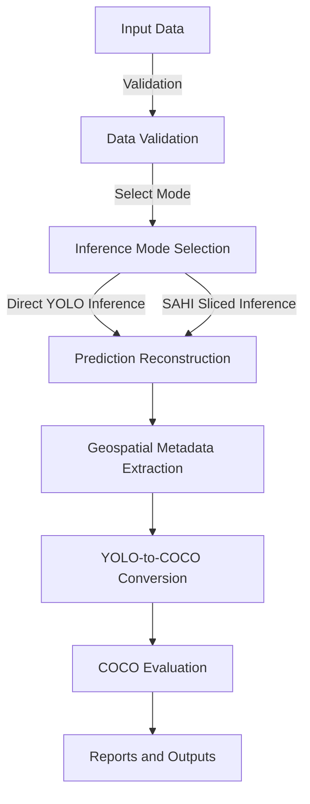

# 🧪 Methodology

## 🌟 Overview

This document describes the methodological workflow used by the **AgriDrone Vision Evaluation Pipeline** to process high-resolution agricultural drone imagery, execute object detection inference, generate normalized predictions, enrich results with geospatial metadata, and evaluate model performance using COCO metrics.

The methodology is designed for applied computer vision experimentation where reproducibility, traceability, and metric consistency are important.

---

## 🎯 Methodological Objectives

The pipeline methodology aims to:

- 📷 Evaluate object detection models on high-resolution drone imagery.
- 🔄 Compare direct YOLO inference with SAHI sliced inference.
- 📂 Preserve prediction outputs in standardized formats.
- 🔄 Convert YOLO annotations and predictions into COCO-compatible artifacts.
- 📊 Compute reproducible object detection metrics.
- 📈 Produce global and per-class performance reports.
- 🌍 Integrate geospatial metadata for downstream spatial analysis.
- 📝 Generate documentation-ready outputs for technical review and portfolio presentation.

---

## 🔄 End-to-End Workflow



---

## 1. Input Data Preparation

The pipeline expects a structured dataset containing images, labels, model weights, and class definitions.

Typical input structure:

```text
data/
  images/
    image_001.jpg
    image_002.jpg

  labels/
    image_001.txt
    image_002.txt

models/
  trained_model.pt

config/
  classes.json
```

Required inputs:

- High-resolution drone images.
- YOLO ground truth annotations.
- Trained YOLO model weights.
- Class dictionary mapping class IDs to labels.
- Inference parameters.
- Input and output directories.

---

## 2. Data Validation

Before inference and evaluation, the system validates the availability and consistency of the required inputs.

Validation checks include:

- Image directory exists.
- Image files are readable.
- Label files exist where required.
- Model weights are available.
- Class IDs match the class dictionary.
- Image dimensions can be read correctly.
- Ground truth and prediction files can be paired with image files.
- COCO conversion requirements are satisfied.

Validation is essential because object detection evaluation is highly sensitive to mismatches between image IDs, label files, class IDs, and bounding box formats.

---

## 3. Inference Strategy Selection

The pipeline supports two main inference strategies.

### Direct YOLO Inference

Direct YOLO inference processes the image using the trained YOLO model without slicing.

Advantages:

- Simpler execution.
- Lower computational cost.
- Faster runtime.
- Fewer post-processing steps.

Limitations:

- Small objects may become difficult to detect when images are resized.
- Detection quality may degrade on large 4K drone images.
- May underperform on dense scenes with small targets.

---

### SAHI Sliced Inference

SAHI inference divides large images into smaller overlapping slices before running object detection.

Advantages:

- Better preservation of small-object detail.
- Improved recall for small objects.
- More suitable for high-resolution aerial imagery.
- Allows inference over very large images without relying only on global resizing.

Limitations:

- Higher computational cost.
- More complex post-processing.
- Risk of duplicate detections near slice boundaries.
- Sensitive to `slice_size`, `overlap_ratio`, and NMS settings.

Recommended use case:

```text
Use SAHI when objects of interest are small relative to the full image or when direct YOLO inference misses relevant detections after resizing.
```

---

## 4. Inference Parameters

Important inference parameters include:

```text
img_size
confidence_threshold
slice_size
overlap_ratio
model_weights_path
input_images_dir
output_predictions_dir
```

Parameter impact:

- `img_size` affects runtime, memory usage, and object scale representation.
- `confidence_threshold` affects false positives and false negatives.
- `slice_size` affects SAHI runtime and object visibility.
- `overlap_ratio` affects boundary detections and duplicate predictions.

Parameter values should be recorded for each experiment to support reproducibility.

---

## 5. Prediction Reconstruction and Normalization

After inference, raw detections are reconstructed and normalized.

For direct YOLO inference:

- Detections are produced directly at image level.
- Bounding boxes are exported in normalized YOLO format.

For SAHI inference:

- Detections are generated per slice.
- Slice-local coordinates are transformed back to full-image coordinates.
- Overlapping detections are merged or filtered.
- Final boxes are normalized relative to the full image dimensions.

Normalized prediction format:

```text
<class_id> <x_center> <y_center> <width> <height> <confidence>
```

This normalized output is useful for traceability, debugging, and conversion into COCO format.

---

## 6. Geospatial Metadata Extraction

The methodology includes spatial enrichment of detection results where drone metadata is available.

The system attempts to extract:

- GPS latitude
- GPS longitude
- Altitude
- Camera metadata
- EXIF metadata
- AGL where available
- UTM coordinates
- Field-of-view coverage estimates

Generated geospatial outputs may include:

- Per-image metadata JSON
- GeoJSON
- CSV
- Shapefiles

This step supports downstream GIS workflows and spatial analytics.

---

## 7. YOLO-to-COCO Conversion

To perform standardized evaluation, YOLO annotations and predictions are converted to COCO format.

Ground truth conversion creates:

```text
gt_coco.json
```

Prediction conversion creates:

```text
pred_coco.json
```

The conversion process must correctly preserve:

- Image IDs
- File names
- Image width and height
- Category IDs
- Bounding boxes
- Detection confidence scores

COCO bounding boxes use the format:

```text
[x_min, y_min, width, height]
```

This differs from normalized YOLO format and must be handled carefully.

---

## 8. COCO Evaluation

The pipeline evaluates detection quality using `pycocotools`.

The evaluation configuration includes:

```text
maxDets = [100, 1000, 3000]
```

This adjustment is important for drone imagery because high-resolution images may contain many objects and standard detection limits may be too restrictive.

Metrics computed include:

- AP50
- AP50:95
- Precision
- Recall
- F1-score
- Per-class metrics

---

## 9. Metrics Computation

The pipeline generates both global and per-class metrics.

### Global Metrics

Global metrics summarize model performance across all classes.

Examples:

- Global AP50
- Global AP50:95
- Global Precision
- Global Recall
- Global F1-score

### Per-Class Metrics

Per-class metrics are essential for diagnosing class imbalance and class-specific weaknesses.

Examples:

- AP50 by class
- AP50:95 by class
- Precision by class
- Recall by class
- F1-score by class

Per-class reporting prevents strong performance on frequent classes from hiding poor performance on underrepresented classes.

---


## YOLO-Native Validation and Benchmarking Methodology

The project also includes a YOLO-native validation path using Ultralytics `model.val()`.

This methodology is useful when the goal is to benchmark trained YOLO checkpoints directly before or alongside COCO-style evaluation.

Key steps:

1. Resolve the trained `best.pt` checkpoint.
2. Read training metadata from `args.yaml` when available.
3. Generate a temporary validation YAML for the intended split.
4. Validate that the temporary YAML points to the correct image directory.
5. Select GPU/CPU device.
6. Execute GPU warm-up when CUDA is available.
7. Clear CUDA cache between runs.
8. Execute `model.val()`.
9. Extract global and per-class metrics.
10. Compute timing statistics such as average time per image.
11. Log metrics to ClearML when enabled.
12. Persist a structured JSON summary.

Recommended detailed document:

```text
docs/yolo-dataset-validation-benchmarking-service.md
```

Important methodological caution:

```text
YOLO-native validation and COCO evaluation are complementary, but they are not automatically equivalent. Their datasets, thresholds, metric definitions, and output formats should be documented when comparing results.
```

---
## 10. Report Generation

The reporting stage saves structured and visual outputs.

Typical generated reports:

```text
eval_metrics_coco.json
global_metrics.json
per_class_metrics.json
metrics.csv
precision_plot.png
recall_plot.png
f1_score_plot.png
ap50_plot.png
ap5095_plot.png
```

These artifacts support:

- Technical documentation.
- Model comparison.
- Research reporting.
- Portfolio presentation.
- Future experiment traceability.

---

## 11. Comparative Evaluation

The methodology supports comparison between direct YOLO inference and SAHI inference.

Comparison criteria:

- AP50
- AP50:95
- Precision
- Recall
- F1-score
- Runtime
- Number of detections
- Per-class differences
- False positives and false negatives

Expected trade-off:

```text
SAHI may improve recall for small objects, but usually increases inference time and post-processing complexity.
```

---

## 12. Batch Execution Model

The current methodology uses synchronous batch execution over image directories.

Current execution model:

```text
for each image:
    load image
    run inference
    export prediction
    extract metadata

convert all predictions and ground truth to COCO
run evaluation
generate reports
```

This approach is appropriate for research workflows. For large-scale production workloads, the image-level steps should be parallelized or moved to a task queue.

---

## 13. Error Handling Methodology

The pipeline uses defensive handling for invalid or incomplete data.

Examples:

- Missing image file: log and continue.
- Unreadable image: skip and log.
- Missing label: warn or skip depending on evaluation mode.
- Invalid class ID: warn and continue or fail depending on strictness.
- GPS/DEM issue: use fallback metadata handling.
- COCO conversion error: stop evaluation step if artifacts are invalid.

Current limitation:

There is no formal retry mechanism with backoff or failure queue.

---

## 14. Reproducibility Requirements

A robust evaluation methodology should record the following for every run:

```text
run_id
model_version
dataset_version
image_count
class_dictionary_version
inference_mode
img_size
confidence_threshold
slice_size
overlap_ratio
maxDets
execution_timestamp
metrics_output_path
```

Recommended artifact:

```text
run_manifest.json
```

---

## 15. Methodological Limitations

The methodology has several important limitations:

- Evaluation quality depends on annotation quality.
- Dataset imbalance can distort global metrics.
- Ambiguous object boundaries can affect AP metrics.
- SAHI results depend heavily on slicing parameters.
- Geospatial outputs depend on metadata availability.
- Runtime can become high for large image sets.
- COCO metrics should be interpreted with domain-specific context.

---

## Recommended Diagram

Recommended diagram file:

```text
assets/agridrone-vision-evaluation-pipeline-flow.png
```

README reference:

```markdown

```
