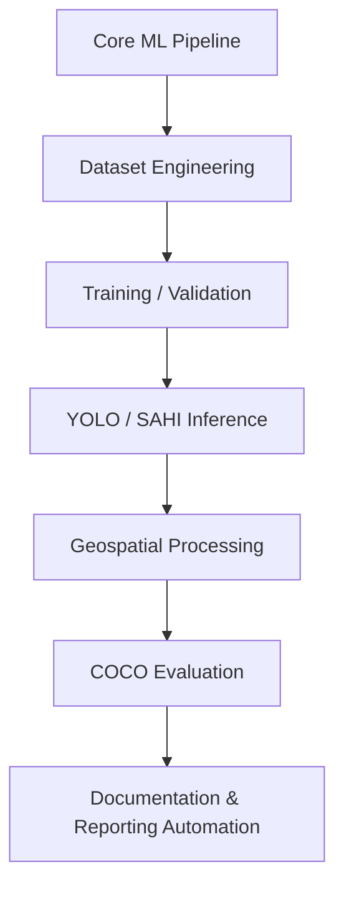

# 📝 Validation Artifact Linking and Documentation Rendering Pipeline

> **Purpose:** Supports reproducible documentation by linking YOLO validation artifacts into Markdown reports and optionally rendering PDF outputs.

---

## 📖 Overview

The **Validation Artifact Linking and Documentation Rendering Pipeline** bridges the gap between machine learning experimentation and reproducible technical documentation. It integrates validation artifacts—such as **confusion matrices**, **metric curves**, **prediction examples**, and **JSON metric summaries**—into Markdown-based documentation using symbolic links, ensuring a **single source of truth**.

Rendered Markdown documentation can be converted into **PDF** using **Pandoc** and **LaTeX** when a publication-style report is needed. These tools belong to the documentation layer and are not core inference or evaluation dependencies.

---

## 🛠️ Component Classification

This module is a **supporting reproducible reporting pipeline**, not a core inference, training, geospatial processing, or COCO evaluation component.

### Classification:

- **📊 Data Processor**
- **🔄 Batch Processing Task**
- **📜 Documentation Automation Utility**
- **🔧 Infrastructure Support Component**
- **📑 Reproducible ML Reporting Module**

> **Scope note:** This document describes an auxiliary reporting workflow. Pandoc, LaTeX, Bash, and symbolic links should be interpreted as documentation/reporting tools rather than core computer vision technologies.

### Project Layer:



---

## 🎯 Main Responsibility

The module automates the integration of **model validation artifacts** into technical documentation while preserving:

- **Traceability**
- **Reproducibility**
- **File Integrity**

### Key Features:

- 📄 **Expose** model validation results in Markdown documentation.
- 🔗 **Link** confusion matrices, curves, visual examples, and metric summaries.
- 🗂️ **Organize** validation artifacts by dataset version or experiment folder convention.
- 🖨️ **Optionally render** documentation into PDF using Pandoc and LaTeX.
- ✅ **Maintain** a single source of truth for experimental artifacts.
- 🚀 **Avoid** duplicating large validation outputs.
- 📊 **Standardize** reporting across dataset versions, experiment folders, or model validation runs.

This pipeline acts as a **bridge** between the **ML experimentation pipeline** and the **reproducible documentation system**.

---

## ❓ Why This Module Matters

In applied computer vision projects, evaluation artifacts are often scattered across training directories, experiment folders, local validation runs, and manually assembled reports.

That creates several problems:

- Reports can become disconnected from the original experiment outputs.
- Copied images may become outdated.
- Metrics may be duplicated inconsistently.
- Dataset-version comparisons become difficult.
- Markdown reports may reference unstable paths.
- PDF generation may break due to missing assets.
- Scientific reproducibility becomes weaker.

This module reduces those risks by standardizing how validation artifacts are discovered, linked, documented, and rendered.

The key idea is:

```text
Validation outputs remain in their original experiment directory,
while documentation references them through stable symbolic links.
```

---

## 📥 Input Artifacts

The pipeline consumes validation outputs generated by YOLO model evaluation runs.

Typical inputs include:

```text
validation_results_summary_run_1.json
confusion_matrix.png
PR_curve.png
P_curve.png
R_curve.png
F1_curve.png
results.png
val_batch0_pred.jpg
dataset.yaml
Markdown documentation file
```

| Category | Examples |
|---|---|
| Validation visualizations | `confusion_matrix.png`, `PR_curve.png`, `F1_curve.png` |
| Prediction examples | `val_batch*_pred.jpg`, styled prediction images |
| Metric summaries | `validation_results_summary_run_1.json`, `results.csv` |
| Dataset configuration | `dataset.yaml`, class names, dataset version or experiment metadata |
| Documentation source | Markdown report template |
| Rendering configuration | Optional Pandoc options, LaTeX engine, fonts |

---

## 📤 Output Artifacts

Typical outputs include:

```text
docs/assets/validation/img-v3/confusion_matrix.png
docs/assets/validation/img-v3/PR_curve.png
docs/assets/validation/img-v3/F1_curve.png
docs/reports/dataset-v3-validation-report.md
docs/reports/dataset-v3-validation-report.pdf
```

| Output | Description |
|---|---|
| Symbolic links | Stable references to validation artifacts |
| Enriched Markdown | Documentation with embedded images and metrics |
| PDF report | Publication-ready report rendered from Markdown |
| Versioned artifact folders | Organized report assets by dataset/model version or experiment folder convention |
| Artifact index | Optional list of linked files and source paths |
| Reproducible report package | Documentation, figures, metrics, and rendering outputs |

---

## 📂 Filesystem Convention

Validation output structure:

```text
valid/
└── valid_dataset/
    └── dataset_version/
        └── detect_timestamp/
            └── img_size/
                └── model/
                    └── run/
                        ├── confusion_matrix.png
                        ├── PR_curve.png
                        ├── P_curve.png
                        ├── R_curve.png
                        ├── F1_curve.png
                        ├── results.png
                        ├── results.csv
                        ├── validation_results_summary_run_1.json
                        └── val_batch0_pred.jpg
```

Documentation asset exposure:

```text
docs/
└── assets/
    └── validation/
        └── img-v3/
            ├── confusion_matrix.png -> original_validation_path/confusion_matrix.png
            ├── PR_curve.png -> original_validation_path/PR_curve.png
            ├── F1_curve.png -> original_validation_path/F1_curve.png
            └── val_batch0_pred.jpg -> original_validation_path/val_batch0_pred.jpg
```

---

## 🔗 Symbolic Linking Strategy

Symbolic links expose validation artifacts inside the documentation tree.

Example:

```bash
ln -s /path/to/validation/run/confusion_matrix.png \
      docs/assets/validation/img-v3/confusion_matrix.png
```

Benefits:

- Avoids duplicating large image artifacts.
- Preserves a single source of truth.
- Allows reports to use stable relative paths.
- Supports multiple dataset versions.
- Reduces storage overhead.
- Keeps the documentation folder lightweight.

---

## ⚙️ Core Workflow

```text
YOLO Validation Run
        │
        ▼
Validation Artifacts Generated
        │
        ▼
Artifact Discovery Script
        │
        ▼
Symbolic Link Creation
        │
        ▼
Dataset-Versioned Documentation Assets
        │
        ▼
Markdown Report References
        │
        ▼
Pandoc + LaTeX Rendering
        │
        ▼
Publication-Ready PDF Report
```

---

## 🔍 Detailed System Flow

### Step 1: Run YOLO Validation

The workflow starts after a YOLO validation process has been executed. The validation process generates confusion matrices, metric curves, prediction examples, JSON summaries, and CSV metric outputs.

### Step 2: Generate Structured Validation Artifacts

The validation run stores outputs inside a structured directory that identifies dataset version, model version, image size, timestamp, run number, and validation configuration.

Example:

```text
valid/valid_dataset/v3/2026-04-15/imgsz_1280/yolo_model/run_1/
```

### Step 3: Discover Relevant Artifacts

The automation script identifies required files for documentation and checks whether each file exists, is readable, is non-empty, and matches the report template.

### Step 4: Create Symbolic Links

The script creates symbolic links from the documentation folder to the original validation outputs.

Example target structure:

```text
docs/assets/validation/img-v3/
├── confusion_matrix.png
├── PR_curve.png
├── P_curve.png
├── R_curve.png
├── F1_curve.png
└── val_batch0_pred.jpg
```

Markdown documentation can then reference assets using relative paths:

```markdown


```

### Step 5: Enrich Markdown Documentation

Markdown documents reference linked artifacts and describe dataset version, model version, training configuration, validation results, metric interpretation, class-level behavior, failure cases, and comparisons between dataset versions.

### Step 6: Render Markdown to PDF

This optional step uses Pandoc to convert the Markdown document into a PDF when a publication-style report is required.

Typical command:

```bash
pandoc report.md \
  -o report.pdf \
  --pdf-engine=xelatex \
  --toc \
  --number-sections
```

The PDF rendering layer depends on Pandoc, LaTeX, xelatex, installed fonts, valid Markdown, valid YAML frontmatter, and accessible image assets. This dependency is isolated to documentation rendering and should not be treated as part of the model inference runtime.

### Step 7: Generate Portable Report Package

The final result is a reproducible documentation package.

Example:

```text
reports/
└── dataset-v3/
    ├── dataset-v3-validation-report.md
    ├── dataset-v3-validation-report.pdf
    ├── artifact-index.json
    └── assets/
        ├── confusion_matrix.png
        ├── PR_curve.png
        └── F1_curve.png
```

For long-term archival or external sharing, copied assets are usually safer than symlinks.

---

## 🛠️ Recommended Scripts

### `link_validation_artifacts.sh`

Responsibilities:

- Receive source validation run path.
- Receive target dataset version.
- Create target documentation asset directory.
- Validate required artifacts.
- Create symbolic links.
- Optionally overwrite existing links.
- Report missing files.

Example:

```bash
bash scripts/link_validation_artifacts.sh \
  --source valid/valid_dataset/v3/detect_20260415/imgsz_1280/model/run_1 \
  --target docs/assets/validation/img-v3
```

### `validate_report_assets.sh`

Responsibilities:

- Verify symlinks exist.
- Verify symlink targets exist.
- Detect broken links.
- Validate image readability.
- Validate JSON files.
- Fail early before PDF rendering.

### `render_markdown_to_pdf.sh`

Responsibilities:

- Validate Markdown source.
- Run Pandoc.
- Use configured LaTeX engine.
- Output PDF.
- Preserve render logs.

---

## ⚙️ Recommended Configuration

```yaml
reporting:
  dataset_version: img-v3
  model_version: yolo-best-run-1
  validation_run_path: valid/valid_dataset/v3/detect_20260415/imgsz_1280/model/run_1
  documentation_assets_dir: docs/assets/validation/img-v3
  markdown_report: docs/reports/dataset-v3-validation-report.md
  pdf_output: docs/reports/dataset-v3-validation-report.pdf

artifacts:
  required:
    - confusion_matrix.png
    - PR_curve.png
    - P_curve.png
    - R_curve.png
    - F1_curve.png
    - validation_results_summary_run_1.json
  optional:
    - results.png
    - val_batch0_pred.jpg
    - val_batch1_pred.jpg

rendering:
  engine: xelatex
  toc: true
  number_sections: true
  fail_on_missing_assets: true
```

---

## ⚠️ Risks and Limitations

### Broken Symbolic Links

If original validation artifacts are moved or deleted, documentation links become invalid.

Recommended mitigation:

- Validate symlink targets before rendering.
- Store artifact index with source and target paths.
- Archive resolved assets for publication.
- Avoid moving original validation runs after report generation.

### Tight Coupling to Filesystem Structure

The current approach depends heavily on specific directory conventions.

Recommended mitigation:

- Move paths into configuration files.
- Avoid hardcoded paths.
- Support CLI arguments.
- Generate an artifact manifest.
- Validate expected folder layout.

### Environment Dependency

PDF rendering depends on Pandoc, LaTeX packages, xelatex, fonts, OS-level packages, Markdown syntax, and YAML frontmatter.

Recommended mitigation:

- Use Docker for report rendering.
- Pin Pandoc and LaTeX versions.
- Provide a `Dockerfile.report`.
- Store render logs.
- Document system dependencies.

### Permission and Locking Issues

On Linux systems, package managers or filesystem locks can affect dependency installation or file operations.

Possible issues include `apt` locks, `dpkg` locks, read-only mounts, restricted symbolic link permissions, and missing write permissions in documentation folders.

### Documentation Rendering Fragility

PDF rendering can fail because of invalid YAML frontmatter, unsupported fonts, broken image paths, malformed Markdown tables, LaTeX special characters, unsupported separators, or non-UTF-8 characters.

### No Formal Retry Logic

This module is batch-oriented but does not include retry mechanisms.

Recommended mitigation:

- Log failed files.
- Allow rerun with `--overwrite`.
- Generate missing artifact report.
- Support dry-run mode.
- Add idempotent link creation.

---

## 🚀 Production Improvements

Recommended improvements:

- YAML-based configuration.
- Artifact manifest generation.
- CLI interface.
- Dry-run mode.
- Overwrite policy.
- Broken-link validation.
- Standalone asset export mode.
- Dockerized Pandoc/LaTeX rendering.
- Markdown linting.
- PDF render logs.
- Experiment registry integration.
- Optional MLflow or ClearML artifact linking if the broader experimentation workflow uses those tools.
- GitHub Actions report rendering.
- Release-ready report packaging.

---

## 🏗️ Proposed Production Architecture

```text
Validation Run Artifacts
        │
        ▼
Artifact Manifest Generator
        │
        ▼
Asset Linker / Resolver
        │
        ▼
Documentation Asset Registry
        │
        ▼
Markdown Report Builder
        │
        ▼
Asset Validation Layer
        │
        ▼
Pandoc / LaTeX Renderer
        │
        ▼
PDF + Markdown Report Package
```

---

## 📂 Suggested Repository Placement

Recommended path:

```text
docs/validation-artifact-reporting-pipeline.md
```

Recommended support scripts:

```text
scripts/
├── link_validation_artifacts.sh
├── validate_report_assets.sh
└── render_markdown_to_pdf.sh
```

Recommended report folders:

```text
reports/
├── dataset-v1/
├── dataset-v2/
└── dataset-v3/
```

Recommended documentation assets:

```text
docs/assets/validation/
├── img-v1/
├── img-v2/
└── img-v3/
```

---

## 📊 Portfolio Summary

This component demonstrates reproducible reporting and documentation automation for computer vision experiments.

It automates the connection between YOLO validation outputs and technical documentation by linking validation artifacts—such as confusion matrices, metric curves, prediction examples, and JSON summaries—into Markdown reports. These reports can then be rendered into publication-ready PDF documents using Pandoc and LaTeX.

The module supports dataset-versioned reporting, avoids duplication of experimental outputs, and preserves a single source of truth for model validation artifacts. It is especially useful in research-grade ML workflows where experiment traceability, report reproducibility, and artifact organization are critical. It should be presented as a supporting documentation module, not as the core of the computer vision system.

---

## 🔒 Privacy and Confidentiality Notice

This documentation describes a generalized reporting automation pipeline.

It should not expose private datasets, confidential validation images, client names, sensitive field locations, internal filesystem paths, proprietary model weights, production credentials, or unpublished experimental results.

Any public repository should use anonymized, synthetic, or non-sensitive examples.
