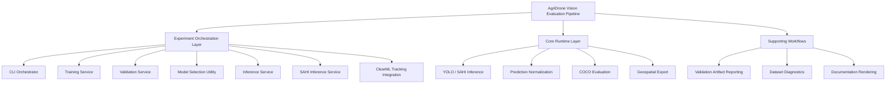

# 🧭 YOLO CLI Training, Validation and Inference Orchestrator

> **Purpose:** CLI-driven experiment orchestration layer for **YOLOv8/YOLOv11** training, validation, model selection, inference, SAHI processing, geospatial outputs, and **ClearML** experiment tracking.

---

## 🌟 Overview

The **YOLO CLI Training, Validation and Inference Orchestrator** is a central module of the `agridrone-vision-evaluation-pipeline` project.

### Purpose
Coordinates the end-to-end machine learning workflow for agricultural drone imagery using **YOLO-based object detection models**. Unlike the validation-artifact reporting module, this component orchestrates:

- **Training** and validation of models
- **Model selection** (best checkpoint identification)
- **Inference** execution (standard and SAHI)
- **Geospatial outputs** generation
- **Experiment tracking** with ClearML

Typical execution:

```bash
conda activate virtual_environment_yolo
python -m scripts.main
```

The orchestrator prompts the user to select the workflow, dataset/project, YOLO version, model size, image size, batch size, thresholds, device/GPU, and input image or directory.

---

## 🛠️ Component Classification

This component can be classified as:

- **🔧 Service Layer**
- **📊 Data Processor**
- **🤖 ML Pipeline Orchestrator**
- **💻 CLI-driven Experiment Runner**
- **🔬 Research-grade ML Workflow Coordinator**

### Project Placement



---

## 🎯 Main Responsibility

The orchestrator coordinates the complete **YOLO experiment workflow**, including:

- **🎛️ CLI Interface:** Select execution mode, project, YOLO version, model size
- **⚙️ Configuration Loading:** Load class labels, visualization colors, hyperparameters
- **🖥️ Device Management:** Select GPU / CPU device and initialize CUDA
- **📊 Training:** Run multi-run training with optional hyperparameter tuning
- **✅ Validation:** Validate trained models and assess performance
- **🏆 Model Selection:** Identify and select the best `best.pt` checkpoint
- **🔍 Inference:** Execute standard YOLO inference on images or directories
- **✂️ SAHI Processing:** Perform sliced inference for improved detection
- **🌍 Geospatial Export:** Generate GeoJSON, Shapefiles, and coordinate metadata
- **📝 Tracking:** Persist metrics and experiment records to **ClearML**

---

## 📥 Inputs

### Configuration Files

| File | Purpose |
|---|---|
| **config.json** | Main training and execution configuration |
| **labels_config.json** | Class labels, colors, and class-related metadata |
| **config_parameters_training.json** | Optional hyperparameter configuration |
| **dataset.yaml** | Dataset definition (YOLOv8/v11 compatible format) |

### CLI Parameters

User selections during execution:

- **Execution Mode:** Training, Validation, Inference, or SAHI
- **Project / Dataset:** Dataset selection
- **Model Configuration:** YOLO version, model size, image size, batch size
- **Device:** GPU / CPU selection
- **Input Source:** Image path or directory
- **SAHI Parameters:** Slice size, overlap, confidence thresholds

### Data Inputs

- 📷 **Images:** Drone imagery in standard formats
- 🏷️ **YOLO Labels:** Annotation files in YOLO format
- 🤖 **Model Weights:** Pre-trained or checkpoint weights
- 🌐 **EXIF / GPS Metadata:** Geospatial information from drone images
- 📊 **Previous Results:** Training metrics and validation outputs

---

## 📤 Outputs

Depending on the selected mode, the orchestrator generates:

### Model Artifacts
- **best.pt** - Best model checkpoint
- **Training Results** - results.csv with epoch-level metrics

### Prediction & Metadata Outputs
- **predictions.json** - Standardized detection predictions
- **results.json** - Aggregated validation results
- **JSON Metadata** - Detection metadata with confidence scores

### Geospatial Outputs
- **GeoJSON** - Georeferenced detections
- **Shapefiles** - Vector-format detections for GIS tools
- **JGW World Files** - Coordinate reference files

### Tracking & Reporting
- **ClearML Task Records** - Experiment tracking data
- **best_metrics_*.json** - Per-model performance summaries
- **Styled Images** - Annotated visualizations with predictions

### Output Roots
```
training_results/  → Model checkpoints and training logs
outputs/           → Predictions and geospatial outputs
valid/             → Validation results
```

---

## 🧩 Main Components

### 1️⃣ CLI Orchestrator

**File:** `scripts/main.py`

**Responsibilities:**
- 🎛️ Act as the application entrypoint
- 📋 Prompt user for execution mode selection
- 🗂️ Select and load project/dataset configuration
- 🎮 Load class labels, visualization colors, hyperparameters
- ⚙️ Initialize GPU/CUDA and ClearML context
- 🚀 Route execution to training, validation, inference, or SAHI workflows

**Architectural Role:**
```
Application Entrypoint → Orchestration Layer
```

### 2️⃣ Training Service

**File:** `scripts/yolo_training.py`

**Responsibilities:**

- execute YOLO training
- support YOLOv8 / YOLOv11 configurations
- run multiple training runs
- manage seeds for reproducibility
- persist model checkpoints
- generate `results.csv`
- save training summaries
- log results to ClearML

Outputs:

```text
best.pt
results.csv
summary.json
training logs
ClearML task records
```

### 2B. Augmentation and Baseline Control

The training pipeline can distinguish between reproducible baseline runs and exploratory augmented runs.

Recommended policy:

```text
run_1      → baseline run, augmentations disabled or minimized
run_2+     → dynamic augmentation policy enabled when configured
```

This distinction matters because baseline and augmented runs should not be compared as identical experimental conditions.

The effective augmentation configuration should be persisted for every run, including:

```text
augment flag
mosaic
mixup
HSV settings
translate
scale
perspective
flip settings
Albumentations transforms when used
```

Technical caution:

```text
A high-level `augment=False` flag may not fully describe all internal Ultralytics augmentation behavior. Persist the effective training parameters rather than relying only on a conceptual label such as "no augmentation".
```

### 3. Validation Service

Representative file:

```text
scripts/validation_yolo.py
```

Responsibilities:

- validate trained models on datasets or individual images
- compute precision, recall, mAP50, mAP50-95, and F1-score
- export validation results
- integrate validation logs with ClearML when configured

### 3B. Validation / Benchmarking Service

Recommended detailed document:

```text
docs/yolo-dataset-validation-benchmarking-service.md
```

This subcomponent extends the general validation service into a reproducible benchmarking workflow.

Responsibilities:

- resolve `best.pt` and training metadata
- read seed and configuration from `args.yaml` when available
- generate temporary validation YAML files for selected splits
- execute GPU warm-up before measurement
- clear CUDA cache between repeated runs
- run Ultralytics `model.val()`
- extract global metrics and per-class arrays from `results.box`
- compute average time per image and standard deviation across runs
- log validation metrics and artifacts to ClearML
- persist `validation_results_summary_run_*.json`

Technical concerns:

- tight coupling to Ultralytics folder structure
- path bugs when rewriting YAML dynamically
- ClearML failures should not break local validation
- class metrics should be persisted with `class_id` and `class_name`, not only as unnamed arrays

### 4. Inference Service

Representative file:

```text
scripts/predict_yolo.py
```

Responsibilities:

- run standard YOLO inference
- run SAHI inference on individual images or directories
- process images, videos, or full directories
- extract detections, classes, confidence scores, and class counts
- reconstruct slice-level detections into full-image coordinates
- generate styled / annotated images
- export per-image prediction JSON and metadata JSON
- extract EXIF/GPS metadata when available
- convert GPS coordinates into UTM when possible
- generate GeoJSON and QGIS-compatible CSV summaries
- generate batch-level JSON and CSV summaries
- optionally persist object crops when configured

Supported functions may include:

```text
run_inference
run_inference_single_image
run_inference_video
run_inference_sahi_single_image
run_inference_sahi_directory
```

Recommended detailed document:

```text
docs/yolo-sahi-inference-geospatial-export-pipeline.md
```

Technical concerns:

- SAHI can create a performance bottleneck on 4K imagery.
- GPU memory pressure can increase with large `img_size`, large model variants, and high slice counts.
- EXIF/GPS metadata may be missing or corrupted.
- Inference and geospatial export are currently coupled in the operational flow.
- Failed-image reprocessing is limited without a formal retry/failure manifest.

### 5. Model Selection Utility

Representative function:

```text
get_best_model()
```

Responsibilities:

- scan previous training run directories
- read `results.csv`
- validate required metric columns
- compute a weighted score
- select the best `best.pt` checkpoint
- export selected model metrics to JSON

Example weighted score:

```text
score = 0.7 * mAP50-95 + 0.3 * F1
```

### 6. Dynamic Training Parameter Loader

Representative function:

```text
select_training_parameters()
```

Responsibilities:

- read optional hyperparameters from `config_parameters_training.json`
- convert types safely
- merge runtime-selected parameters into training configuration
- support repeatable experiment configuration

### 7. ClearML Integration

Representative utilities:

```text
start_clearml_task()
setup_credentials_clearml_task()
fetch_and_store_clearml_data()
```

Responsibilities:

- initialize ClearML tasks
- configure experiment tracking credentials
- log metrics, tasks, and metadata
- associate runs with selected datasets/projects
- support experiment review and traceability

Scope clarification:

ClearML is an **external experiment tracking integration**, not a core model inference dependency.

### 8. Geospatial Processing Layer

Representative file:

```text
geo_data_utils.py
```

Responsibilities:

- extract EXIF/GPS metadata
- convert coordinates
- handle UTM / WGS84 outputs
- process DEM or terrain elevation where available
- generate GeoJSON, CSV, shapefile, and JGW artifacts

### 8B. Raster Georeferencing & QGIS Automation

Recommended detailed document:

```text
docs/raster-georeferencing-qgis-automation-pipeline.md
```

This subcomponent extends inference outputs by making styled detection images usable as georeferenced rasters in QGIS.

Responsibilities:

- copy EXIF/XMP metadata from original images to styled outputs
- generate `.jgw` world files for styled JPEGs
- optionally convert styled rasters to GeoTIFF using GDAL
- support PyQGIS batch loading
- persist CRS and world-file assumptions in metadata

Technical caution:

```text
EXIF GPS metadata alone is not enough for QGIS raster placement. Styled JPEGs require `.jgw` sidecar files or GeoTIFF conversion.
```

### 9. Utility Layer

Representative files:

```text
utils.py
utils_prompts.py
clearml_utils.py
```

Responsibilities:

- path handling
- prompts and CLI interaction
- model selection
- JSON generation
- logging helpers
- configuration utilities
- label/color loading

---

## 🔄 End-to-End Flow

```text
User executes CLI
        │
        ▼
scripts/main.py
        │
        ▼
Load configuration and labels
        │
        ▼
Select execution mode
        │
        ├── Train
        │     └── train_yolo → best.pt, results.csv, ClearML logs
        │
        ├── Validate
        │     └── validation_yolo → metrics, reports, ClearML logs
        │
        └── Inference / SAHI
              └── predict_yolo → detections, metadata, GeoJSON, Shapefiles
```

---

## 🔍 Detailed System Flow

### Step 1: CLI Trigger

The workflow starts when the user executes:

```bash
conda activate virtual_environment_yolo
python -m scripts.main
```

The CLI prompts for execution mode, project/dataset, YOLO version, model size, image size, batch size, thresholds, device/GPU, and image or directory path.

### Step 2: Configuration Loading

The orchestrator loads:

```text
config.json
assets/json/labels_config.json
assets/json/config_parameters_training.json
dataset.yaml
```

It also initializes:

- GPU / CUDA context
- ClearML credentials and task settings
- dataset paths
- output paths
- class labels and colors

### Step 3: Mode Selection

Supported modes may include:

```text
train
validation
inference
SAHI inference
video inference
single-image inference
directory inference
```

### Step 4A: Training Mode

In training mode:

1. `main.py` reads training configuration.
2. Optional hyperparameters are merged from `config_parameters_training.json`.
3. `train_yolo()` executes one or multiple runs.
4. Each run creates a structured folder.
5. ClearML task is initialized.
6. Metrics and checkpoints are saved.
7. `best.pt`, `results.csv`, and summaries are persisted.

Typical outputs:

```text
training_results/
├── model_name/
│   ├── image_size/
│   │   ├── run_1/
│   │   │   ├── weights/best.pt
│   │   │   ├── results.csv
│   │   │   └── summary.json
```

### Step 4B: Validation Mode

In validation mode:

1. The user selects a model manually or automatically.
2. `get_best_model()` can scan previous results.
3. `validation_yolo.py` runs validation.
4. Metrics are computed and exported.
5. ClearML logs may be generated.

Metrics include:

```text
precision
recall
mAP50
mAP50-95
F1-score
```

### Step 4C: Inference Mode

In inference mode:

1. `get_best_model()` can retrieve the best checkpoint.
2. `predict_yolo.py` loads the model.
3. The system processes an image, video, or directory.
4. It generates detections, class summaries, styled images, JSON outputs, metadata, and geospatial artifacts.
5. When EXIF/GPS metadata exists, coordinates can be converted to UTM and exported as GeoJSON or QGIS-ready CSV.
6. In batch mode, consolidated JSON/CSV summaries can be generated.

Possible outputs:

```text
predictions.json
summary.json
batch_summary.json
batch_summary.csv
JSON_metadata/
styled-images/
GeoJSON
Shapefile
QGIS_summary.csv
JGW files
annotated videos
tracking_summary.json
SRT frame summaries
object-crops/
```

### Step 4D: SAHI Inference Mode

### 4E: Video Tracking Mode

Recommended detailed document:

```text
docs/yolo-video-inference-object-tracking-processor.md
```

In video mode:

1. `predict_yolo.py` opens the input video using OpenCV.
2. Frames are processed sequentially.
3. YOLO `model.track()` is executed with persistent tracking when configured.
4. Detections are parsed from `result.boxes`.
5. Tracking IDs are extracted from `box.id`.
6. `ObjectCounter` accumulates unique object IDs by class.
7. Custom OpenCV overlays are rendered on each frame.
8. The annotated video is written to disk.
9. A final JSON summary and optional `.srt` frame-level artifact are exported.

Technical concerns:

- unique counts depend on tracker ID stability
- `box.id` may be unavailable for some detections
- video rendering and encoding can become bottlenecks
- RGB/BGR conversion must be controlled to preserve visual fidelity
- partial MP4/JSON/SRT outputs should be handled with temporary paths and final promotion

#### Video Mode Implementation Contracts

The video mode should document lower-level contracts because it is more stateful than image inference.

Recommended contracts:

```text
safe_extract_bbox_info_video
    validate xyxy / xywh
    extract confidence, class ID, and tracking ID
    record invalid detections

draw_styled_boxes_and_summary_video
    normalize labels and colors
    apply dynamic font and border scaling
    use fallback colors and fonts
    preserve BGR/RGB consistency

save_video_processing_results
    convert NumPy and tensor values to JSON-safe types
    persist processing metrics
    persist output paths and artifact status
```

Recommended validation before processing:

```text
labels_dict keys can be converted to int
colors map covers configured classes or fallback color exists
video codec is available
VideoWriter can be opened
output directory is writable
resolved best.pt belongs to selected project/configuration
```

Recommended finalization:

```text
cap.release()
writer.release()
cv2.destroyAllWindows()
```

In SAHI mode:

1. A high-resolution image is sliced.
2. YOLO inference is executed per slice.
3. Detections are reconstructed into full-image coordinates.
4. Duplicates are filtered.
5. Predictions are exported.
6. Metadata and spatial outputs are generated.

SAHI is especially useful for 4K drone imagery where small targets may be missed by direct resizing.

### Step 5: Best Model Selection

The model selection utility scans previous training results.

It reads:

```text
results.csv
```

It validates metric columns and computes a weighted score:

```text
score = 0.7 * mAP50-95 + 0.3 * F1
```

The best checkpoint is selected:

```text
best.pt
```

A summary artifact may be saved:

```text
best_metrics_*.json
```

### Step 6: Persistence

The system persists artifacts in local filesystem directories:

```text
outputs/
training_results/
valid/
```

Output artifacts include model checkpoints, metrics CSV, JSON summaries, prediction JSON, metadata JSON, styled images, GeoJSON, shapefiles, world files, and ClearML records.

### Step 7: Experiment Tracking

ClearML is used as an external tracking system.

Tracked information may include task name, dataset/project name, training configuration, metrics, logs, selected model, and run metadata.

ClearML improves traceability, but the pipeline should still preserve local run manifests for portability.

---

## 🧠 Implementation-Specific Behavior

### Multi-GPU Training Modes

The training layer may run in one of several execution modes:

```text
single GPU
PyTorch DataParallel
Distributed Data Parallel
```

This affects output paths, metric collection, CUDA memory pressure, and reproducibility. The run summary should record the selected execution mode and device identifiers.

### DDP Subprocesses and Execution Semantics

Distributed Data Parallel execution may launch subprocesses through `torch.distributed.run`.

This should be documented as:

```text
distributed training execution
```

not as:

```text
persistent background processing or task-queue architecture
```

The overall system remains CLI/script-driven and synchronous unless a formal job queue, worker layer, or scheduler is added.

### CUDA Memory Stabilization

Large YOLOv11 variants, 2048px/4K imagery, high batch sizes, and DDP can create CUDA OOM or memory fragmentation.

Runtime stabilization practices may include:

```text
torch.cuda.empty_cache()
gc.collect()
PYTORCH_CUDA_ALLOC_CONF=expandable_segments:True
```

These settings should be recorded when used because they affect reproducibility, diagnostics, and deployment planning.

### YOLOv8 vs YOLOv11 Runtime Trade-off

YOLOv11 variants may consume substantially more VRAM than YOLOv8 under comparable image size and batch configurations. Model family selection should therefore be treated as both an accuracy decision and an infrastructure decision.

### Batch Size Sensitivity

Very small batch sizes, especially batch size 1, may produce unstable or artificially optimistic metrics in some configurations. Batch size must be recorded and considered when comparing experiments.


### Training Metrics Fallback

In some execution paths, especially with multi-GPU training, `model.train()` may not return a complete metrics object. The orchestrator should handle this as a formal branch:

```text
train_yolo()
   ├── metrics available → persist metrics
   └── metrics missing / None → load run best.pt → execute validation → persist recovered metrics
```

The resulting summary should include:

```text
metric_source
post_training_validation_used
validated_checkpoint_path
```

### Checkpoint Lineage Protection

Before validation or inference, the system should verify that the selected `best.pt` belongs to the intended run and configuration.

Recommended lineage fields:

```text
run_id
training_run_id
model_path
checkpoint_hash_or_size
source_results_csv
args_yaml_path
selected_metric_row
model_family
img_size
batch_size
seed
```

### Model Weight Resolution Strategy

If weights are missing locally, the system may need to resolve or download model weights into the local model directory. This should be treated as a formal step and logged. Base model weights and trained checkpoints must not be confused.

Recommended fields:

```text
requested_model
resolved_model_path
weight_source
was_downloaded
is_base_model_or_trained_checkpoint
checksum_or_file_size
```

### Seed Generation Strategy

If seeds are dynamically generated from base seed, run index, distributed rank, timestamp, or random component, both the input components and the final resolved seed should be persisted.

### Research Mode vs Production-Oriented Mode

This orchestrator currently mixes research-oriented execution and production-oriented concerns. The distinction should be explicit:

| Mode | Characteristics |
|---|---|
| Research / experimentation | Interactive prompts, multiple runs, exploratory configuration, local artifacts |
| Production-oriented batch execution | Non-interactive config, stable run IDs, retry manifests, structured logs, fixed model registry |

### Champion Model Strategy

For future production-oriented use, model selection should avoid relying on a single global `best.pt`. A champion model should be selected per configuration scope, such as dataset version, image size, inference mode, model family, and operational objective.

---

### Ultralytics Output Folder Collision Risk

Ultralytics can auto-increment output directories when a target path already exists, producing folders such as:

```text
results
results2
results3
```

Downstream model selection, validation, and reporting should resolve the actual output path from persisted run metadata rather than assuming a fixed folder name.

### Project and Dataset Name Sanitization

Project names and dataset names are used as filesystem path components. They should be sanitized before output folder creation to avoid invalid characters, path traversal issues, and inconsistent artifact discovery.

### Video Output Artifacts

When video inference is enabled, the inference pipeline may generate:

```text
processed video output
frame-level detection metadata
.srt subtitle files
```

These outputs should be documented as optional inference artifacts and should include run and model lineage.

### JSON-Driven Project Selection

For video and inference workflows, project selection should preferably come from validated JSON configuration rather than free-text project names.

Recommended behavior:

```text
load project configuration
display available projects by index
resolve selected project key
sanitize project/dataset name for filesystem use
persist raw and resolved project names
```

This reduces path bugs, spelling drift, and model-selection ambiguity.

## 📂 Recommended Repository Placement

Recommended document path:

```text
docs/yolo-cli-training-validation-inference-pipeline.md
```

Representative module layout:

```text
scripts/
├── main.py
├── yolo_training.py
├── validation_yolo.py
├── predict_yolo.py
├── utils.py
├── utils_prompts.py
├── clearml_utils.py
└── geo_data_utils.py
```

Configuration layout:

```text
config.json
assets/json/
├── labels_config.json
└── config_parameters_training.json
```

Output layout:

```text
training_results/
outputs/
valid/
```

---

## ⚙️ Configuration Strategy

The current workflow is configuration-assisted, but not yet fully configuration-driven.

Current configuration sources:

```text
config.json
labels_config.json
config_parameters_training.json
dataset.yaml
CLI prompts
```

Recommended future structure:

```text
config/
├── experiment.yaml
├── dataset.yaml
├── training.yaml
├── inference.yaml
└── geospatial.yaml
```

A typed configuration layer would reduce key mismatch errors, path drift, inconsistent CLI prompts, invalid parameter types, and fragile dataset switching.

Recommended tools:

- Pydantic
- Hydra
- OmegaConf
- JSON Schema
- Typer / Click for CLI commands

---

## 🚨 Technical Risks

### Tight Coupling Between CLI, Configuration and Execution

Risk:

- changes to prompts or config keys can break downstream execution
- modules are harder to automate in CI/CD
- non-interactive execution is limited

Mitigation:

- introduce explicit CLI subcommands
- support config-only execution
- validate configuration before running
- isolate orchestration from business logic

### Filesystem Path Dependency

Risk:

- path changes break execution
- mounted volume permissions can cause failures
- portability across machines is reduced

Mitigation:

- centralize paths in configuration
- avoid absolute paths where possible
- validate read/write permissions before execution
- support environment variables for machine-specific roots

### Temporary validation YAML fragility

Dynamic generation of validation YAML files can create incorrect dataset paths if paths are joined more than once or if the original YAML uses unexpected roots.

Mitigation:

- validate temporary YAML files before running `model.val()`
- generate per-run temporary YAML names instead of reusing `temp_val.yaml`
- normalize paths before writing YAML
- test split redirection logic with synthetic datasets

### Configuration Drift

There is a risk of mismatch between:

```text
config.json
dataset.yaml
labels_config.json
training_results/
Roboflow export folders
```

Mitigation:

- validate class names and class IDs across files
- validate dataset paths before training
- generate a run manifest
- store resolved configuration with each run

### Interactive Prompt Limitation

Risk:

- harder to automate
- harder to run in CI/CD
- harder to schedule
- harder to reproduce exact commands

Mitigation:

- add command-line flags
- add non-interactive mode
- store prompt selections in run config
- support `--config experiment.yaml`

### No Formal Retry Logic

There are no automatic retries for I/O failures, ClearML logging issues, inference failures, missing or locked files, or network issues.

Mitigation:

- add failure logs
- implement retry for non-deterministic I/O
- continue batch execution safely
- support failed-item reprocessing

### Partial Observability

The system uses logs and ClearML, but structured operational observability is limited.

Mitigation:

- add structured JSON logs
- track per-stage duration
- save failed image list
- persist run-level manifest
- log ClearML failures separately from pipeline failures

---

## ⚠️ Known Failure Modes

| Failure Mode | Cause | Resolution / Mitigation |
|---|---|---|
| Multiple inconsistent timestamps | Timestamps generated in several modules | Generate timestamp once in `main.py` and pass it downstream |
| Output path mismatch | Incorrect dataset/project folder resolution | Centralize output path construction |
| Missing `best_metrics.json` | Directory not created before write | Use `os.makedirs(output_dir, exist_ok=True)` before writing |
| `NoneType` error in AGL calculation | DEM lookup returned `None` | Add fallback terrain elevation handling |
| Module import errors | Incorrect execution context | Run with `python -m scripts.main` |
| ClearML logging error | Incorrect API usage or log-level casting | Validate ClearML logging calls |
| Dataset permission issue | Mounted dataset folder not writable | Validate cache/output permissions |
| Duplicate labels warning | Duplicate labels in YOLO files | Add label QA and duplicate detection checks |

---

## 🧪 Reproducibility Recommendations

Every run should persist a manifest such as:

```json
{
  "run_id": "experiment_001",
  "mode": "train",
  "dataset": "dataset_name",
  "dataset_yaml": "path/to/dataset.yaml",
  "model_family": "YOLOv11",
  "model_size": "l",
  "image_size": 1280,
  "batch_size": 8,
  "device": "cuda:0",
  "seed": 42,
  "config_files": {
    "main": "config.json",
    "labels": "assets/json/labels_config.json",
    "training_parameters": "assets/json/config_parameters_training.json"
  },
  "outputs": {
    "training_results": "training_results/...",
    "best_model": "training_results/.../weights/best.pt"
  }
}
```

---

## 🧪 Testing Recommendations

High-priority tests:

- config loading tests
- class dictionary consistency tests
- dataset YAML path validation
- `results.csv` metric column validation
- `get_best_model()` selection tests
- inference output schema tests
- SAHI reconstruction tests
- geospatial output generation tests
- ClearML failure isolation tests

---

## 🚀 Production Hardening Roadmap

### Phase 1: Stabilize Local Experimentation

- add typed configuration
- reduce interactive prompts
- add run manifest
- centralize path management
- improve structured logging

### Phase 2: Improve Automation

- add CLI subcommands
- support non-interactive execution
- add retry for I/O and ClearML logging
- add tests for core transformations
- add reproducible environment files

### Phase 3: Scale Execution

- add local multiprocessing
- add GPU-aware batching
- add storage abstraction
- optionally add task queue if multi-user or scheduled execution becomes necessary

### Phase 4: Productionize

- add API layer if needed
- add worker-based execution
- add centralized monitoring
- add role-based access control if sensitive data is processed
- add artifact registry or model registry

---

## 📊 Maturity Assessment

Current maturity:

```text
Prototype avanzado / High-maturity research system
```

Strengths:

- end-to-end YOLO workflow
- multi-run training
- best-model selection
- SAHI inference support
- geospatial outputs
- ClearML tracking
- modular file organization
- structured artifacts

Limitations:

- interactive CLI
- local filesystem dependence
- partial error handling
- no background workers
- no retry logic
- no typed configuration layer
- limited CI/CD automation

This module is strong for research-grade experimentation and internal ML development. To become production-ready, it should evolve toward configuration-driven execution, typed validation, stronger observability, and better automation.

---


## 🔒 Privacy and Confidentiality Notice

This documentation describes the technical architecture and methodology of a YOLO experimentation pipeline in a generalized form.

It does not expose private datasets, client or company names, sensitive field locations, production credentials, private model weights, internal infrastructure paths, or unpublished experimental results.

Any examples included in a public repository should be anonymized, synthetic, or non-sensitive.
